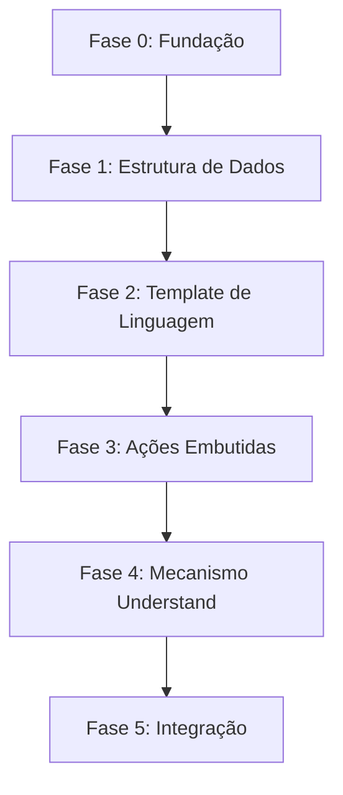

# DeepSeek — Exportação de Conversas

> **Exportado em:** 13/09/2026, 13:44:57
> **Conversas exportadas:** 1
> **Total de mensagens:** 10

---

## 1. Allegory.js

> **ID:** `de561454-37e2-430a-9937-af5afd192492` · **Criada:** 12/09/2026, 19:25:06 · **Atualizada:** 13/09/2026, 13:35:06 · **Mensagens:** últimas 10 de 108

### 📄 USER

façaa agora plano de BLUEPRINT
    ↓
"Qual é a estrutura da casa?"_ de forma completa, do funcionamento o parser de inform 7

### 📄 ASSISTANT

# 🏗️ Blueprint Estrutural — O Parser do Inform 7

> **Documento:** Estrutura arquitetural do parser do Inform 7
> **Versão:** 1.0
> **Pergunta central:** "Qual é a estrutura da casa?"
> **Foco:** Layout, componentes, relações, fluxos e organização interna.

---

## Índice

1. [Visão Estrutural](#1-visão-estrutural)
2. [As 63 Secções — Mapa Completo](#2-as-63-secções--mapa-completo)
3. [Blocos Funcionais](#3-blocos-funcionais)
4. [Variáveis e Arrays](#4-variáveis-e-arrays)
5. [Fluxo de Dados](#5-fluxo-de-dados)
6. [Grafo de Dependências](#6-grafo-de-dependências)
7. [Estrutura de Tokens](#7-estrutura-de-tokens)
8. [Estrutura de Escopo](#8-estrutura-de-escopo)
9. [Estrutura de Rulebooks](#9-estrutura-de-rulebooks)
10. [Estrutura de Compilação](#10-estrutura-de-compilação)
11. [Mapa de Integração](#11-mapa-de-integração)
12. [Resumo Estrutural](#12-resumo-estrutural)

---

## 1. Visão Estrutural

O parser do Inform 7 é uma **casa de 63 quartos** (secções) organizada em **12 blocos funcionais**, sustentada por **~240 vigas** (variáveis globais) e **5 alicerces** (arrays fixos). Cada quarto tem uma função específica, e a casa é percorrida em uma **ordem fixa** de visita.

### 1.1 Planta Baixa

```
┌─────────────────────────────────────────────────────────────────────┐
│                        PARSER (63 secções)                          │
│                                                                     │
│  ┌──────────────┐  ┌──────────────┐  ┌──────────────┐              │
│  │  VARIÁVEIS   │  │   PALAVRAS   │  │  PREPARAÇÃO  │              │
│  │  §1  §2  §3  │  │  §4  §5      │  │  §6  §7  §8  │              │
│  └──────────────┘  └──────────────┘  └──────────────┘              │
│                                                                     │
│  ┌──────────────────────────────────────────────────────────────┐  │
│  │                    LEITURA (§9)                              │  │
│  └──────────────────────────────────────────────────────────────┘  │
│                                                                     │
│  ┌──────────────────────────────────────────────────────────────┐  │
│  │              PARSER PRINCIPAL (§10–§22)                      │  │
│  │  A  B  C  D  E  F  G  H  I  J  K                             │  │
│  └──────────────────────────────────────────────────────────────┘  │
│                                                                     │
│  ┌──────────────────────────────────────────────────────────────┐  │
│  │              ANÁLISE DE TOKENS (§23–§29)                     │  │
│  │  A  B  C  D  E  F                                            │  │
│  └──────────────────────────────────────────────────────────────┘  │
│                                                                     │
│  ┌──────────────┐  ┌──────────────┐  ┌──────────────┐              │
│  │ DESCRITORES  │  │  DOMÍNIO     │  │DESAMBIGUAÇÃO │              │
│  │ §30 §31 §32  │  │    §34       │  │    §35       │              │
│  │    §33       │  │              │  │ §36–§40      │              │
│  └──────────────┘  └──────────────┘  └──────────────┘              │
│                                                                     │
│  ┌──────────────┐  ┌──────────────┐  ┌──────────────┐              │
│  │  UTILITÁRIOS │  │   ESCOPO     │  │    NOMES     │              │
│  │ §41–§44      │  │ §45–§50      │  │ §51–§56      │              │
│  └──────────────┘  └──────────────┘  └──────────────┘              │
│                                                                     │
│  ┌──────────────┐  ┌──────────────┐                                │
│  │   GÊNERO     │  │    ESCOLHA   │                                │
│  │ §57–§61      │  │ §62–§63      │                                │
│  └──────────────┘  └──────────────┘                                │
└─────────────────────────────────────────────────────────────────────┘
```

### 1.2 Metáfora da Casa

| Elemento da Casa | Elemento do Parser | Quantidade |
|------------------|-------------------|------------|
| **Quartos** | Secções | 63 |
| **Andares** | Blocos funcionais | 12 |
| **Vigas** | Variáveis globais | ~240 |
| **Alicerces** | Arrays fixos | 5 |
| **Portas** | Pontos de entrada/saída | 6 |
| **Corredores** | Fluxos de dados | 8 |

---

## 2. As 63 Secções — Mapa Completo

### 2.1 Andar 1 — Variáveis (§1–§3)

| Secção | Nome | Função |
|--------|------|--------|
| §1 | Grammar Line Variables | Variáveis para análise de linhas gramaticais |
| §2 | Grammar Token Variables | Variáveis para tokens |
| §3 | Match List Variables | Variáveis para lista de matches |

### 2.2 Andar 2 — Palavras (§4–§5)

| Secção | Nome | Função |
|--------|------|--------|
| §4 | Words | Processamento de palavras |
| §5 | Snipsets | Fragmentos de texto |

### 2.3 Andar 3 — Preparação (§6–§8)

| Secção | Nome | Função |
|--------|------|--------|
| §6 | Unpacking Grammar Lines | Desempacotamento de grammar lines |
| §7 | Extracting Verb Numbers | Extração de números de verbo |
| §8 | Keyboard Primitive | Primitiva de teclado |

### 2.4 Andar 4 — Leitura (§9)

| Secção | Nome | Função |
|--------|------|--------|
| §9 | Reading the Command | Leitura do comando |

### 2.5 Andar 5 — Parser Principal (§10–§22)

| Secção | Nome | Função |
|--------|------|--------|
| §10 | Parser Proper | Parser principal |
| §11 | Parser Letter A | Inicialização |
| §12 | Parser Letter B | Verificação de conversa |
| §13 | Parser Letter C | Verificação de ator |
| §14 | Parser Letter D | Obtenção do verbo |
| §15 | Parser Letter E | Desdobramento da sintaxe |
| §16 | Parser Letter F | Lookahead para multiexcept/multiinside |
| §17 | Parser Letter G | Análise de tokens |
| §18 | Parser Letter H | Parse de conversa |
| §19 | Parser Letter I | Impressão de erro |
| §20 | Parser Letter J | Retry |
| §21 | Parser Letter K | Fim do parser |
| §22 | (vazio/reservado) | — |

### 2.6 Andar 6 — Análise de Tokens (§23–§29)

| Secção | Nome | Função |
|--------|------|--------|
| §23 | Parse Token | Análise de tokens |
| §24 | Parse Token Letter A | Inicialização do token |
| §25 | Parse Token Letter B | Verificação de múltiplos |
| §26 | Parse Token Letter C | Parse de descritores |
| §27 | Parse Token Letter D | Parse de nome de objeto |
| §28 | Parse Token Letter E | Parse de preposições |
| §29 | Parse Token Letter F | Finalização do token |

### 2.7 Andar 7 — Descritores (§30–§33)

| Secção | Nome | Função |
|--------|------|--------|
| §30 | Descriptors | Artigos, pronomes, etc. |
| §31 | (vazio/reservado) | — |
| §32 | Preposition Chain | Cadeia de preposições |
| §33 | Creature | Criaturas |

### 2.8 Andar 8 — Domínio e Desambiguação (§34–§40)

| Secção | Nome | Função |
|--------|------|--------|
| §34 | **Noun Domain** | **Resolução de objetos** |
| §35 | **Adjudicate** | **Desambiguação** |
| §36 | ReviseMulti | Revisão de múltiplos |
| §37 | Match List | Lista de matches |
| §38 | ScoreMatchL | Pontuação de matches |
| §39 | BestGuess | Melhor palpite |
| §40 | SingleBestGuess | Melhor palpite único |

### 2.9 Andar 9 — Utilitários (§41–§44)

| Secção | Nome | Função |
|--------|------|--------|
| §41 | Identical | Comparação de objetos |
| §42 | Print Command | Impressão de comando |
| §43 | CantSee | Erro de visibilidade |
| §44 | Multiple Object List | Lista de objetos múltiplos |

### 2.10 Andar 10 — Escopo (§45–§50)

| Secção | Nome | Função |
|--------|------|--------|
| §45 | **Scope** | **Verificação de escopo** |
| §46 | Scope Level 0 | Nível 0 |
| §47 | **SearchScope** | **População do escopo** |
| §48 | ScopeWithin | Adição de objetos ao escopo |
| §49 | DoScopeActionAndRecurse | Recursão de escopo |
| §50 | DoScopeAction | Ação de escopo |

### 2.11 Andar 11 — Nomes e Gênero (§51–§61)

| Secção | Nome | Função |
|--------|------|--------|
| §51 | Parsing Object Names | Casamento de nomes |
| §52 | TryGivenObject | Tenta um objeto |
| §53 | Refers | Referência |
| §54 | NounWord | Palavra de nome |
| §55 | TryNumber | Tenta um número |
| §56 | (vazio/reservado) | — |
| §57 | Gender | Gênero |
| §58 | Plurals | Plurais |
| §59 | Pronoun Handling | Pronomes |
| §60 | Yes/No Questions | Perguntas sim/não |
| §61 | Number Words | Palavras numéricas |

### 2.12 Andar 12 — Escolha (§62–§63)

| Secção | Nome | Função |
|--------|------|--------|
| §62 | **Choose Objects** | **Desambiguação customizável** |
| §63 | Default Topic | Tópico padrão |

---

## 3. Blocos Funcionais

### 3.1 Diagrama de Blocos

```
┌─────────────────────────────────────────────────────────────────────┐
│                                                                     │
│  ┌─────────────────────────────────────────────────────────────┐   │
│  │  BLOCO 1: VARIÁVEIS E DADOS (§1–§3)                         │   │
│  │  - Grammar Line Variables                                    │   │
│  │  - Grammar Token Variables                                   │   │
│  │  - Match List Variables                                      │   │
│  └─────────────────────────────────────────────────────────────┘   │
│                              │                                      │
│                              ▼                                      │
│  ┌─────────────────────────────────────────────────────────────┐   │
│  │  BLOCO 2: PALAVRAS E PREPARAÇÃO (§4–§8)                     │   │
│  │  - Words                                                     │   │
│  │  - Snipsets                                                  │   │
│  │  - Unpacking Grammar Lines                                   │   │
│  │  - Extracting Verb Numbers                                   │   │
│  │  - Keyboard Primitive                                        │   │
│  └─────────────────────────────────────────────────────────────┘   │
│                              │                                      │
│                              ▼                                      │
│  ┌─────────────────────────────────────────────────────────────┐   │
│  │  BLOCO 3: LEITURA (§9)                                      │   │
│  │  - Reading the Command                                       │   │
│  └─────────────────────────────────────────────────────────────┘   │
│                              │                                      │
│                              ▼                                      │
│  ┌─────────────────────────────────────────────────────────────┐   │
│  │  BLOCO 4: PARSER PRINCIPAL (§10–§22)                        │   │
│  │  - Parser Proper                                             │   │
│  │  - Letters A–K                                               │   │
│  └─────────────────────────────────────────────────────────────┘   │
│                              │                                      │
│                              ▼                                      │
│  ┌─────────────────────────────────────────────────────────────┐   │
│  │  BLOCO 5: ANÁLISE DE TOKENS (§23–§29)                       │   │
│  │  - Parse Token                                               │   │
│  │  - Letters A–F                                               │   │
│  └─────────────────────────────────────────────────────────────┘   │
│                              │                                      │
│                              ▼                                      │
│  ┌─────────────────────────────────────────────────────────────┐   │
│  │  BLOCO 6: DESCRITORES (§30–§33)                             │   │
│  │  - Descriptors                                               │   │
│  │  - Preposition Chain                                         │   │
│  │  - Creature                                                  │   │
│  └─────────────────────────────────────────────────────────────┘   │
│                              │                                      │
│                              ▼                                      │
│  ┌─────────────────────────────────────────────────────────────┐   │
│  │  BLOCO 7: DOMÍNIO E DESAMBIGUAÇÃO (§34–§40)                 │   │
│  │  - Noun Domain                                               │   │
│  │  - Adjudicate                                                │   │
│  │  - ScoreMatchL                                               │   │
│  │  - BestGuess / SingleBestGuess                               │   │
│  └─────────────────────────────────────────────────────────────┘   │
│                              │                                      │
│                              ▼                                      │
│  ┌─────────────────────────────────────────────────────────────┐   │
│  │  BLOCO 8: UTILITÁRIOS (§41–§44)                             │   │
│  │  - Identical                                                 │   │
│  │  - Print Command                                             │   │
│  │  - CantSee                                                   │   │
│  │  - Multiple Object List                                      │   │
│  └─────────────────────────────────────────────────────────────┘   │
│                              │                                      │
│                              ▼                                      │
│  ┌─────────────────────────────────────────────────────────────┐   │
│  │  BLOCO 9: ESCOPO (§45–§50)                                  │   │
│  │  - Scope                                                     │   │
│  │  - SearchScope                                               │   │
│  │  - ScopeWithin                                               │   │
│  │  - DoScopeActionAndRecurse                                   │   │
│  └─────────────────────────────────────────────────────────────┘   │
│                              │                                      │
│                              ▼                                      │
│  ┌─────────────────────────────────────────────────────────────┐   │
│  │  BLOCO 10: NOMES E GÊNERO (§51–§61)                         │   │
│  │  - Parsing Object Names                                      │   │
│  │  - TryGivenObject                                            │   │
│  │  - Gender / Plurals / Pronouns                               │   │
│  └─────────────────────────────────────────────────────────────┘   │
│                              │                                      │
│                              ▼                                      │
│  ┌─────────────────────────────────────────────────────────────┐   │
│  │  BLOCO 11: ESCOLHA (§62–§63)                                │   │
│  │  - Choose Objects                                            │   │
│  │  - Default Topic                                             │   │
│  └─────────────────────────────────────────────────────────────┘   │
│                                                                     │
└─────────────────────────────────────────────────────────────────────┘
```

---

## 4. Variáveis e Arrays

### 4.1 Estrutura de Dados

```
┌─────────────────────────────────────────────────────────────────────┐
│                    ESTRUTURA DE DADOS DO PARSER                     │
│                                                                     │
│  ┌─────────────────────────────────────────────────────────────┐   │
│  │  ARRAYS FIXOS (5 arrays de 32 elementos)                    │   │
│  │                                                             │   │
│  │  pattern[32]      → Match atual                             │   │
│  │  pattern2[32]     → Melhor match até agora                  │   │
│  │  line_ttype[32]   → Tipo de cada token                      │   │
│  │  line_tdata[32]   → Dados de cada token                     │   │
│  │  line_token[32]   → Token real                              │   │
│  └─────────────────────────────────────────────────────────────┘   │
│                                                                     │
│  ┌─────────────────────────────────────────────────────────────┐   │
│  │  VARIÁVEIS GLOBAIS (~240)                                   │   │
│  │                                                             │   │
│  │  GRAMÁTICA:                                                 │   │
│  │    pcount, pcount2                                          │   │
│  │                                                             │   │
│  │  ERRO:                                                      │   │
│  │    best_etype, nextbest_etype                               │   │
│  │                                                             │   │
│  │  PARSING:                                                   │   │
│  │    parser_inflation, inferfrom, inferword                   │   │
│  │    wn (word number), verb_word, action                      │   │
│  │                                                             │   │
│  │  NÚMERO:                                                    │   │
│  │    nens, params_wanted                                      │   │
│  │                                                             │   │
│  │  MATCH:                                                     │   │
│  │    match_length, number_matched, match_from                 │   │
│  │    length_of_noun                                           │   │
│  │                                                             │   │
│  │  ESCOPO:                                                    │   │
│  │    scope_token, scope_stage                                 │   │
│  └─────────────────────────────────────────────────────────────┘   │
│                                                                     │
└─────────────────────────────────────────────────────────────────────┘
```

### 4.2 Arrays de Gramática

```
line_ttype[0]  line_tdata[0]  line_token[0]   → Primeiro token
line_ttype[1]  line_tdata[1]  line_token[1]   → Segundo token
line_ttype[2]  line_tdata[2]  line_token[2]   → Terceiro token
...
line_ttype[31] line_tdata[31] line_token[31]  → 32º token
```

### 4.3 Arrays de Padrão

```
pattern[0]  pattern[1]  pattern[2]  ...  pattern[31]   → Match atual
pattern2[0] pattern2[1] pattern2[2] ...  pattern2[31]  → Melhor match
```

---

## 5. Fluxo de Dados

### 5.1 Fluxo Principal

```
┌──────────────┐
│ Texto bruto  │  "TAKE THE SWORD"
└──────┬───────┘
       │
       ▼
┌──────────────┐
│ §9 Leitura   │  Tokeniza o comando
└──────┬───────┘
       │
       ▼
┌──────────────┐
│ §10 Parser   │  Loop principal
│ Proper       │
└──────┬───────┘
       │
       ▼
┌──────────────┐
│ §6 Unpack    │  Preenche line_ttype, line_tdata
│ Grammar Line │
└──────┬───────┘
       │
       ▼
┌──────────────┐
│ §23 Parse    │  Para cada token
│ Token        │
└──────┬───────┘
       │
       ▼
┌──────────────┐
│ §34 Noun     │  Resolve objeto
│ Domain       │
└──────┬───────┘
       │
       ▼
┌──────────────┐
│ §47 Search   │  Popula match_list
│ Scope        │
└──────┬───────┘
       │
       ▼
┌──────────────┐
│ §38 Score    │  Pontua candidatos
│ MatchL       │
└──────┬───────┘
       │
       ▼
┌──────────────┐
│ §35 Adjud    │  Escolhe melhor
│ icate        │
└──────┬───────┘
       │
       ▼
┌──────────────┐
│ Ação         │  [TAKE, sword]
└──────┬───────┘
       │
       ▼
┌──────────────┐
│ Rulebooks    │  Before → Instead → Check
│              │  → Carry Out → After → Report
└──────────────┘
```

### 5.2 Fluxo de Escopo

```
┌──────────────┐
│ NounDomain   │
└──────┬───────┘
       │
       ▼
┌──────────────┐
│ SearchScope  │
└──────┬───────┘
       │
       ├──► Nível 0: scope... token → delega
       │
       ├──► Nível 1: "deciding the scope of"
       │
       └──► Nível 2:
              ├──► MULTIINSIDE → conteúdo do 2º objeto
              ├──► Sala → conteúdo da sala do ator
              ├──► domain1 → conteúdo de domain1
              ├──► domain2 → conteúdo e partes de domain2
              └──► Escuridão → ator e partes
```

---

## 6. Grafo de Dependências

### 6.1 Dependências entre Secções

```
§1 Variáveis ◄──────────────────────────────────┐
§2 Variáveis ◄──────────────────────────────────┤
§3 Variáveis ◄──────────────────────────────────┤
                                                │
§4 Words ◄──────────────────────────────────────┤
§5 Snipsets ◄───────────────────────────────────┤
                                                │
§6 Unpack Grammar ◄─────────────────────────────┤
§7 Extract Verb ◄───────────────────────────────┤
§8 Keyboard ◄───────────────────────────────────┤
                                                │
§9 Reading Command ◄────────────────────────────┤
                                                │
§10 Parser Proper ◄─────────────────────────────┤
§11-§22 Letters A-K ◄───────────────────────────┤
                                                │
§23 Parse Token ◄───────────────────────────────┤
§24-§29 Letters A-F ◄───────────────────────────┤
                                                │
§30 Descriptors ◄───────────────────────────────┤
§32 Preposition Chain ◄─────────────────────────┤
§33 Creature ◄──────────────────────────────────┤
                                                │
§34 NounDomain ◄────────────────────────────────┤
§35 Adjudicate ◄────────────────────────────────┤
§36-§40 Listas ◄────────────────────────────────┤
                                                │
§41-§44 Utilitários ◄───────────────────────────┤
                                                │
§45-§50 Scope ◄─────────────────────────────────┤
                                                │
§51-§56 Nomes ◄─────────────────────────────────┤
                                                │
§57-§61 Gênero ◄────────────────────────────────┤
                                                │
§62-§63 Escolha ◄───────────────────────────────┘
```

### 6.2 Dependências Críticas

```
§9 Reading Command
    │
    ├──► §10 Parser Proper
    │       │
    │       ├──► §6 Unpack Grammar Line
    │       │       │
    │       │       └──► §23 Parse Token
    │       │               │
    │       │               ├──► §34 NounDomain
    │       │               │       │
    │       │               │       ├──► §47 SearchScope
    │       │               │       │       │
    │       │               │       │       └──► §48 ScopeWithin
    │       │               │       │
    │       │               │       └──► §35 Adjudicate
    │       │               │               │
    │       │               │               ├──► §38 ScoreMatchL
    │       │               │               │
    │       │               │               └──► §62 ChooseObjects
    │       │               │
    │       │               └──► §30 Descriptors
    │       │
    │       └──► §11-§22 Letters A-K
    │
    └──► §4 Words
```

---

## 7. Estrutura de Tokens

### 7.1 Tipos de Token

```
┌─────────────────────────────────────────────────────────────────────┐
│                         TOKENS                                      │
│                                                                     │
│  ┌─────────────────────────────────────────────────────────────┐   │
│  │  TOKENS DE OBJETO                                            │   │
│  │  NOUN_TOKEN         → [something]                            │   │
│  │  HELD_TOKEN         → [something preferably held]            │   │
│  │  CREATURE_TOKEN     → [someone]                              │   │
│  └─────────────────────────────────────────────────────────────┘   │
│                                                                     │
│  ┌─────────────────────────────────────────────────────────────┐   │
│  │  TOKENS DE MÚLTIPLOS                                         │   │
│  │  MULTI_TOKEN        → [things]                               │   │
│  │  MULTIHELD_TOKEN    → [things preferably held]               │   │
│  │  MULTIINSIDE_TOKEN  → [things inside]                        │   │
│  │  MULTIEXCEPT_TOKEN  → [other things]                         │   │
│  └─────────────────────────────────────────────────────────────┘   │
│                                                                     │
│  ┌─────────────────────────────────────────────────────────────┐   │
│  │  TOKENS ESPECIAIS                                            │   │
│  │  SPECIAL_TOKEN      → [number]                               │   │
│  │  TOPIC_TOKEN        → [text]                                 │   │
│  └─────────────────────────────────────────────────────────────┘   │
│                                                                     │
└─────────────────────────────────────────────────────────────────────┘
```

### 7.2 Estrutura de uma Grammar Line

```
line_ttype[0] = VERB_TOKEN      line_tdata[0] = ##Take
line_ttype[1] = NOUN_TOKEN      line_tdata[1] = 0
line_ttype[2] = END_TOKEN       line_tdata[2] = 0
```

### 7.3 Estrutura de um Token de Objeto

```
NOUN_TOKEN
    │
    ├──► domain1 = localização do ator
    ├──► domain2 = ator
    ├──► context = NOUN_TOKEN
    │
    └──► NounDomain(domain1, domain2, context)
            │
            ├──► SearchScope → match_list
            │
            └──► Adjudicate → objeto escolhido
```

---

## 8. Estrutura de Escopo

### 8.1 Camadas de Escopo

```
┌─────────────────────────────────────────────────────────────────────┐
│                         ESCOPO                                      │
│                                                                     │
│  ┌─────────────────────────────────────────────────────────────┐   │
│  │  CAMADA 1: SCOPE TOKEN                                      │   │
│  │  Se o contexto é um scope... token, delega para o estágio 2 │   │
│  └─────────────────────────────────────────────────────────────┘   │
│                              │                                      │
│                              ▼                                      │
│  ┌─────────────────────────────────────────────────────────────┐   │
│  │  CAMADA 2: ACTIVIDADE                                       │   │
│  │  "deciding the scope of" é chamada                          │   │
│  └─────────────────────────────────────────────────────────────┘   │
│                              │                                      │
│                              ▼                                      │
│  ┌─────────────────────────────────────────────────────────────┐   │
│  │  CAMADA 3: PADRÃO                                           │   │
│  │  (1) MULTIINSIDE → conteúdo do 2º objeto                    │   │
│  │  (2) Sala → conteúdo da sala do ator                        │   │
│  │  (3) domain1 → conteúdo de domain1                          │   │
│  │  (4) domain2 → conteúdo e partes de domain2                 │   │
│  │  (5) Escuridão → ator e partes                              │   │
│  └─────────────────────────────────────────────────────────────┘   │
│                                                                     │
└─────────────────────────────────────────────────────────────────────┘
```

### 8.2 Relação Escopo / Toque

```
┌─────────────────────────────────────────────────────────────────────┐
│                                                                     │
│  ESCOPO (pode ser examinado)                                        │
│  ┌─────────────────────────────────────────────────────────────┐   │
│  │  Objetos na sala                                            │   │
│  │  Objetos segurados                                          │   │
│  │  Objetos em contêineres transparentes                       │   │
│  │  Partes do ator                                             │   │
│  └─────────────────────────────────────────────────────────────┘   │
│                                                                     │
│  TOQUE (pode ser pego/tocado)                                       │
│  ┌─────────────────────────────────────────────────────────────┐   │
│  │  Objetos segurados                                          │   │
│  │  Objetos na sala                                            │   │
│  │  Objetos em contêineres abertos                             │   │
│  │  Partes do ator                                             │   │
│  └─────────────────────────────────────────────────────────────┘   │
│                                                                     │
│  ESCOPO ⊃ TOQUE (nem tudo que está em escopo pode ser tocado)       │
│                                                                     │
└─────────────────────────────────────────────────────────────────────┘
```

---

## 9. Estrutura de Rulebooks

### 9.1 Sequência de Rulebooks

```
┌─────────────────────────────────────────────────────────────────────┐
│                    SEQUÊNCIA DE AÇÃO                                │
│                                                                     │
│  ┌──────────────┐                                                   │
│  │   BEFORE     │  Regras antes da ação (global)                    │
│  │              │  Default: No Decision                             │
│  └──────┬───────┘                                                   │
│         │                                                           │
│         ▼                                                           │
│  ┌──────────────┐                                                   │
│  │   INSTEAD    │  Substituição da ação (global)                    │
│  │              │  Default: Failure                                 │
│  └──────┬───────┘                                                   │
│         │                                                           │
│         ▼                                                           │
│  ┌──────────────┐                                                   │
│  │   CHECK      │  Verificação da ação (específico)                 │
│  │              │  Default: No Decision                             │
│  └──────┬───────┘                                                   │
│         │                                                           │
│         ▼                                                           │
│  ┌──────────────┐                                                   │
│  │  CARRY OUT   │  Execução da ação (específico)                    │
│  │              │  Default: No Decision                             │
│  └──────┬───────┘                                                   │
│         │                                                           │
│         ▼                                                           │
│  ┌──────────────┐                                                   │
│  │    AFTER     │  Regras após a ação (global)                      │
│  │              │  Default: Success                                 │
│  └──────┬───────┘                                                   │
│         │                                                           │
│         ▼                                                           │
│  ┌──────────────┐                                                   │
│  │   REPORT     │  Narração da ação (específico)                    │
│  │              │  Default: No Decision                             │
│  └──────────────┘                                                   │
│                                                                     │
└─────────────────────────────────────────────────────────────────────┘
```

### 9.2 Sequência Completa de Ação

```
1. antes (before)
2. visibilidade, acessibilidade, requisitos de carregamento
3. em vez (instead)
4. persuasão
5. verificação (check)
6. execução (carry out)
7. depois (after)
8. relatório (report)
```

### 9.3 Sequência de Turno

```
1. Parse command rule
2. declare everything initially unmentioned
3. generate action rule
4. early scene changing stage rule
5. every turn stage rule
6. timed events rule
7. advance time rule
8. update chronological records rule
9. late scene changing rule
10. adjust light rule
11. note object acquisitions rule
12. notify score changes rule
```

---

## 10. Estrutura de Compilação

### 10.1 Pipeline de Compilação

```
┌─────────────────────────────────────────────────────────────────────┐
│                    PIPELINE DE COMPILAÇÃO                           │
│                                                                     │
│  ┌──────────────┐                                                   │
│  │  Inform 7    │  Linguagem natural                                │
│  │  (ni)        │                                                   │
│  └──────┬───────┘                                                   │
│         │                                                           │
│         ▼                                                           │
│  ┌──────────────┐                                                   │
│  │    Inter     │  Representação intermediária neutra               │
│  │  (inter)     │                                                   │
│  └──────┬───────┘                                                   │
│         │                                                           │
│         ▼                                                           │
│  ┌──────────────┐                                                   │
│  │  Inform 6    │  Linguagem procedural                             │
│  │  (inform6)   │                                                   │
│  └──────┬───────┘                                                   │
│         │                                                           │
│         ▼                                                           │
│  ┌──────────────┐                                                   │
│  │  Z-code ou   │  Bytecode de VM                                   │
│  │  Glulx       │                                                   │
│  └──────────────┘                                                   │
│                                                                     │
└─────────────────────────────────────────────────────────────────────┘
```

### 10.2 Estrutura do Template

```
┌─────────────────────────────────────────────────────────────────────┐
│                    TEMPLATE DO PARSER (B/parst)                     │
│                                                                     │
│  ┌─────────────────────────────────────────────────────────────┐   │
│  │  §1–§3    Variáveis                                         │   │
│  │  §4–§5    Palavras                                          │   │
│  │  §6–§8    Preparação                                        │   │
│  │  §9       Leitura                                           │   │
│  │  §10–§22  Parser Principal                                  │   │
│  │  §23–§29  Análise de Tokens                                 │   │
│  │  §30–§33  Descritores                                       │   │
│  │  §34–§40  Domínio e Desambiguação                           │   │
│  │  §41–§44  Utilitários                                       │   │
│  │  §45–§50  Escopo                                            │   │
│  │  §51–§56  Nomes                                             │   │
│  │  §57–§61  Gênero                                            │   │
│  │  §62–§63  Escolha                                           │   │
│  └─────────────────────────────────────────────────────────────┘   │
│                                                                     │
└─────────────────────────────────────────────────────────────────────┘
```

---

## 11. Mapa de Integração

### 11.1 O Parser no Sistema Híbrido

```
┌─────────────────────────────────────────────────────────────────────┐
│                    SISTEMA HÍBRIDO DE 12 CAMADAS                    │
│                                                                     │
│  ┌─────────────────────────────────────────────────────────────┐   │
│  │  CAMADA 1: PARSER (Inform 7)                                │   │
│  │  ┌─────────────────────────────────────────────────────┐   │   │
│  │  │  Texto bruto → Parser → Ação estruturada            │   │   │
│  │  │  "TAKE SWORD" → [TAKE, sword]                       │   │   │
│  │  └─────────────────────────────────────────────────────┘   │   │
│  └──────────────────────────┬──────────────────────────────────┘   │
│                              │ Intent                              │
│                              ▼                                      │
│  ┌─────────────────────────────────────────────────────────────┐   │
│  │  CAMADA 2: SELEÇÃO (ENE + Allegory.js)                      │   │
│  └──────────────────────────┬──────────────────────────────────┘   │
│                              │ Action                              │
│                              ▼                                      │
│  ┌─────────────────────────────────────────────────────────────┐   │
│  │  CAMADA 3: CAPACIDADES (Sharpee)                            │   │
│  └──────────────────────────┬──────────────────────────────────┘   │
│                              │ BehaviorResult                      │
│                              ▼                                      │
│  ┌─────────────────────────────────────────────────────────────┐   │
│  │  CAMADAS 4–11: Física, Social, Canais, Diálogo, Prosa, etc. │   │
│  └─────────────────────────────────────────────────────────────┘   │
│                                                                     │
└─────────────────────────────────────────────────────────────────────┘
```

### 11.2 Adaptador de Ação para Intent

```
┌─────────────────────────────────────────────────────────────────────┐
│                    ADAPTADOR                                        │
│                                                                     │
│  Ação (Inform 7)              Intent (Sistema Híbrido)             │
│  ─────────────────            ────────────────────────             │
│  action.verb                  → intent.name                        │
│  action.actor                 → intent.actors                      │
│  action.noun                  → intent.targets                     │
│  action.secondNoun            → intent.auxiliary                   │
│  action.raw                   → intent.raw                         │
│  action.dryRun                → intent.dryRun                      │
│  action.confidence            → intent.confidence                  │
│                                                                     │
└─────────────────────────────────────────────────────────────────────┘
```

---

## 12. Resumo Estrutural

### 12.1 A Casa em Números

| Elemento | Quantidade |
|----------|------------|
| **Secções** | 63 |
| **Blocos funcionais** | 12 |
| **Variáveis globais** | ~240 |
| **Arrays fixos** | 5 |
| **Tipos de token** | 9 |
| **Rulebooks** | 6 |
| **Pontos de entrada** | 6 |
| **Fluxos de dados** | 8 |
| **Camadas de escopo** | 3 |

### 12.2 A Casa em Uma Frase

**O parser do Inform 7 é uma casa de 63 quartos (secções) organizada em 12 andares (blocos funcionais), sustentada por ~240 vigas (variáveis globais) e 5 alicerces (arrays fixos), percorrida em uma ordem fixa de visita que transforma texto bruto em ação estruturada através de leitura, análise, resolução, desambiguação e processamento de rulebooks.**

### 12.3 A Planta Baixa Final

```
┌─────────────────────────────────────────────────────────────────────┐
│                                                                     │
│                    TEXTO BRUTO DO JOGADOR                           │
│                              │                                      │
│                              ▼                                      │
│  ┌─────────────────────────────────────────────────────────────┐   │
│  │                    PARSER (63 secções)                      │   │
│  │                                                             │   │
│  │  §1-§3   Variáveis                                          │   │
│  │  §4-§5   Palavras                                           │   │
│  │  §6-§8   Preparação                                         │   │
│  │  §9      Leitura                                            │   │
│  │  §10-§22 Parser Principal                                   │   │
│  │  §23-§29 Análise de Tokens                                  │   │
│  │  §30-§33 Descritores                                        │   │
│  │  §34-§40 Domínio e Desambiguação                            │   │
│  │  §41-§44 Utilitários                                        │   │
│  │  §45-§50 Escopo                                             │   │
│  │  §51-§56 Nomes                                              │   │
│  │  §57-§61 Gênero                                             │   │
│  │  §62-§63 Escolha                                            │   │
│  │                                                             │   │
│  └──────────────────────────┬──────────────────────────────────┘   │
│                              │                                      │
│                              ▼                                      │
│                    AÇÃO ESTRUTURADA                                 │
│                    [verbo, objetos]                                 │
│                              │                                      │
│                              ▼                                      │
│  ┌─────────────────────────────────────────────────────────────┐   │
│  │                    RULEBOOKS                                │   │
│  │  Before → Instead → Check → Carry Out → After → Report      │   │
│  └──────────────────────────┬──────────────────────────────────┘   │
│                              │                                      │
│                              ▼                                      │
│                    NARRAÇÃO FINAL                                   │
│                                                                     │
└─────────────────────────────────────────────────────────────────────┘
```

---

**Fim do Blueprint Estrutural do Parser do Inform 7.**

Este documento descreve a estrutura arquitetural do parser, seus componentes, relações, fluxos e organização interna. Para a documentação de uso, consulte a Documentação; para os contratos, consulte a Especificação; para a ordem de construção, consulte o Plano de Implementação.

*Versão: 1.0 · Licença: MIT*

### 📄 USER

e sobre a biblioteca do vocabulário de inform 7 , consegue me informar por completo?

### 📄 ASSISTANT

Sim, consigo detalhar a biblioteca de vocabulário do Inform 7. Ela não é um simples dicionário de palavras, mas um sistema sofisticado com múltiplas camadas: a **estrutura de dados** que armazena as palavras, o **template de linguagem** que define os termos fundamentais, e as **ações e comandos** embutidos que dão vida ao jogo.

### 🧠 A Estrutura de Dados do Vocabulário

Na base de tudo, o compilador do Inform 7 (escrito em C) cria um objeto `vocabulary_entry` para cada palavra única encontrada no código-fonte[reference:0]. Esta estrutura é otimizada para velocidade e contém:

*   **`exemplar` e `hash`**: O texto da palavra e um código hash para buscas rápidas.
*   **`flags` (Meaning Codes)**: Um bitmap que indica em quais contextos a palavra pode ser usada (ex: `NUMBER_MC` para números, `ING_MC` para palavras terminadas em "-ing")[reference:1].
*   **`literal_number_value`**: Armazena o valor numérico, se a palavra for um número (ex: "17")[reference:2].
*   **`lower_case_form` e `upper_case_form`**: Ponteiros para outras entradas, permitindo que o parser trate "Sword" e "sword" como equivalentes[reference:3].
*   **`nt_incidence` (Nonterminal Incidence)**: Um bitmap que indica em quais regras gramaticais do compilador (Preform) a palavra se encaixa[reference:4].

Toda a biblioteca é armazenada em uma **tabela hash** para que a comparação de uma nova palavra com o vocabulário existente seja muito rápida. Essa otimização aumentou a velocidade do Inform em 5 a 10 vezes[reference:5].

### 📜 O Template de Linguagem (Language Template)

Este é o coração do vocabulário fundamental do jogo, definido no arquivo `B/langt`[reference:6]. Ele estabelece as palavras e estruturas que o parser precisa conhecer para se comunicar com o jogador.

*   **§1. Vocabulário**: Define constantes para palavras-chave essenciais, como `AGAIN`, `OOPS`, `UNDO`, `ALL`, `AND`, `BUT`, `YES`, `NO`, `QUIT`, `RESTART` e `RESTORE`[reference:7].
*   **§2. Pronomes**: Uma tabela (`LanguagePronouns`) que mapeia palavras como 'it', 'him', 'her', 'them' para seus respectivos gêneros e números gramaticais[reference:8].
*   **§3. Descritores**: Uma tabela (`LanguageDescriptors`) que define artigos e pronomes possessivos ('a', 'an', 'the', 'my', 'this', 'that') e como eles se conectam aos substantivos[reference:9].
*   **§4. Números**: Define como números são escritos e reconhecidos.
*   **§6. Direções**: Define os nomes das direções (norte, sul, leste, oeste, etc.).

### 🎮 Ações Embutidas e Comandos Padrão

O Inform 7 vem com um conjunto de cerca de **50 ações embutidas** que são automaticamente compreendidas pelo parser[reference:10]. Isso significa que, sem escrever nenhuma linha de código, o jogador já pode se mover, examinar objetos, pegá-los, usar inventário, abrir portas, vestir roupas, etc.[reference:11].

Alguns exemplos de ações e seus comandos:

*   **Ações de Movimento**: `GO [direction]`, `ENTER [something]`, `EXIT`, `GET OFF [something]`.
*   **Ações de Manipulação**: `TAKE [something]`, `DROP [something]`, `PUT [something] ON [something]`, `INSERT [something] INTO [something]`.
*   **Ações de Interação**: `EXAMINE [something]`, `LOOK`, `SEARCH [something]`, `LISTEN`.
*   **Ações de Comunicação**: `ASK [someone] ABOUT [a topic]`, `TELL [someone] ABOUT [a topic]`, `ANSWER [someone] THAT [a topic]`.
*   **Ações de Estado**: `OPEN [something]`, `CLOSE [something]`, `LOCK [something] WITH [something]`, `UNLOCK [something] WITH [something]`.
*   **Ações de Vestuário**: `WEAR [something]`, `REMOVE [something]`.

O comando `SHOWVERB [verb]` no jogo exibe a gramática interna do parser para um verbo, e o comando `ACTIONS` (em modo de depuração) mostra como cada comando é interpretado[reference:12][reference:13].

### 🧩 Tokens de Gramática Padrão

Para que o autor estenda o vocabulário, o Inform 7 oferece **tokens de gramática** que são padrões que o parser tenta casar. Os principais são[reference:14]:

*   **`[something]`**: Casar com um objeto específico.
*   **`[someone]`**: Casar com uma pessoa.
*   **`[things]`**: Casar com uma lista de objetos ou a palavra "all"[reference:15].
*   **`[things inside]`**: Casar apenas com o que está dentro do segundo objeto nomeado. Isso impede que "take all from box" tente pegar a própria caixa[reference:16].
*   **`[other things]`**: Casar com qualquer coisa, exceto o segundo objeto nomeado[reference:17].
*   **`[something preferably held]`**: O parser prefere objetos que o jogador está segurando, ajudando a resolver ambiguidades[reference:18].
*   **`[any things]`**: Casar com qualquer coisa, sem restrição de local. Deve ser usado com cuidado, pois pode casar "ALL" com consequências inesperadas[reference:19].

### ✍️ Personalizando o Vocabulário

O autor pode modificar e estender o vocabulário usando a frase `Understand`.

*   **Adicionar Sinônimos para um Objeto**: `Understand "sword" and "blade" as the rusty sword.`
*   **Adicionar Sinônimos para uma Ação**: `Understand "get [something]" or "pick up [something]" as taking.`
*   **Criar um Novo Comando**: `Understand "use [something] on [something]" as using it on.`
*   **Remover um Comando Existente**: A frase `Understand the command "take" as something new.` remove a palavra "take" de **todos** os significados que ela possa ter no parser, incluindo ações como "taking inventory"[reference:20]. É uma ferramenta poderosa que deve ser usada com cautela.

### 📚 Extensões (Extensions)

Além do vocabulário padrão, a comunidade mantém um vasto repositório de **extensões** no GitHub (`i7/extensions`). Essas extensões podem adicionar novas ações, comandos e vocabulário especializado, como sistemas de conversação avançados, comandos de depuração adicionais ou funcionalidades para gêneros específicos de jogos[reference:21].

Em resumo, a "biblioteca de vocabulário" do Inform 7 é um sistema em camadas que vai desde a estrutura de dados de baixo nível até as ações de alto nível, oferecendo um vocabulário padrão rico e um mecanismo flexível para que o autor o expanda conforme a necessidade do seu jogo.

Se quiser se aprofundar em algum aspecto específico, como a criação de novos tokens de gramática ou a modificação de ações embutidas, é só me avisar.

### 📄 USER

faça  o blueprint completo de  biblioteca do vocabulário de inform 7

### 📄 ASSISTANT

# 🏗️ Blueprint Completo — A Biblioteca de Vocabulário do Inform 7

> **Documento:** Arquitetura da biblioteca de vocabulário do Inform 7
> **Versão:** 1.0
> **Base:** Código-fonte `ganelson/inform` (v10.1+), template `B/langt`, documentação oficial

---

## 1. Visão Geral

A biblioteca de vocabulário do Inform 7 não é um simples dicionário de palavras. É um **sistema em múltiplas camadas** que vai desde a estrutura de dados de baixo nível (no compilador, escrito em C) até as ações de alto nível (no runtime, escritas em Inform 6). Cada camada tem uma função específica e se comunica com as demais através de contratos bem definidos.

### 1.1 As Três Camadas

| Camada | Onde Vive | Função | Linguagem |
|--------|-----------|--------|-----------|
| **Camada 1: Estrutura de Dados** | Compilador (`words` module) | Armazena e classifica palavras | C |
| **Camada 2: Template de Linguagem** | Runtime (`B/langt`) | Define vocabulário fundamental | Inform 6 |
| **Camada 3: Ações e Comandos** | Runtime (biblioteca padrão) | Dá vida ao jogo | Inform 6 + Inform 7 |

### 1.2 Diagrama de Camadas

```
┌─────────────────────────────────────────────────────────────────────┐
│                                                                     │
│  ┌─────────────────────────────────────────────────────────────┐   │
│  │  CAMADA 3: AÇÕES E COMANDOS                                 │   │
│  │  ~50 ações embutidas, tokens de gramática, Understand       │   │
│  │  "TAKE [something]" → Taking action                         │   │
│  └─────────────────────────────────────────────────────────────┘   │
│                              ▲                                      │
│                              │ usa                                  │
│                              ▼                                      │
│  ┌─────────────────────────────────────────────────────────────┐   │
│  │  CAMADA 2: TEMPLATE DE LINGUAGEM (B/langt)                  │   │
│  │  §1 Vocabulary  §2 Pronouns  §3 Descriptors                 │   │
│  │  §4 Numbers  §5 Time  §6 Directions  §7 Translation         │   │
│  │  §8 Articles  §9 Commands  §10-§13 Textos                   │   │
│  └─────────────────────────────────────────────────────────────┘   │
│                              ▲                                      │
│                              │ usa                                  │
│                              ▼                                      │
│  ┌─────────────────────────────────────────────────────────────┐   │
│  │  CAMADA 1: ESTRUTURA DE DADOS (words module)                │   │
│  │  vocabulary_entry, hash table, meaning codes, flags         │   │
│  └─────────────────────────────────────────────────────────────┘   │
│                                                                     │
└─────────────────────────────────────────────────────────────────────┘
```

---

## 2. Camada 1 — Estrutura de Dados

A base de tudo é o módulo `words` do compilador, escrito em C. Ele cria um objeto `vocabulary_entry` para cada palavra única encontrada no código-fonte.

### 2.1 O `vocabulary_entry`

Cada entrada de vocabulário é uma estrutura otimizada para velocidade de comparação:

```c
typedef struct vocabulary_entry {
    unsigned int flags;              // Bitmap de "meaning codes"
    int literal_number_value;        // Valor numérico, se for número
    wchar_t *exemplar;               // Texto de uma instância da palavra
    wchar_t *raw_exemplar;           // Texto em forma bruta
    int hash;                        // Código hash do texto
    struct vocabulary_entry *next_in_vocab_hash;  // Próximo na lista hash
    struct vocabulary_entry *lower_case_form;     // Forma minúscula
    struct vocabulary_entry *upper_case_form;     // Forma maiúscula
    int nt_incidence;                // Bitmap de nonterminals Preform
} vocabulary_entry;
```

**Propósito:** O `vocabulary_entry` existe para tornar comparações textuais mais rápidas, o que é essencial para que o Inform rode toleravelmente rápido. A velocidade do Inform em textos típicos aumentou por um fator de **5 a 10 vezes** quando esta estrutura foi introduzida [reference:0].

### 2.2 A Tabela Hash

O vocabulário é armazenado em uma **tabela hash** para que a comparação de uma nova palavra com o vocabulário existente seja rápida. Cada palavra armazena listas ligadas de significados que ela inicia, ocorre no meio, termina, ou é opcionalmente parte [reference:1].

### 2.3 Meaning Codes (Flags)

Cada palavra carrega um **bitmap de flags** indicando os contextos em que pode ser usada:

```c
define ING_MC 0x04000000        // Palavra terminando em -ing
define NUMBER_MC 0x08000000     // Números (one, two, ..., 1, 2, ...)
define I6_MC 0x10000000         // Código I6 verbatim
define TEXTWITHSUBS_MC 0x20000000  // Texto com substituições
define TEXT_MC 0x40000000       // Texto sem substituições
define ORDINAL_MC 0x80000000    // Ordinais (first, second, ...)
```

### 2.4 Cache de Números

Para evitar parsing repetido do mesmo texto como número inteiro, o resultado é cacheado: por exemplo, **17** para o texto "17" [reference:2].

### 2.5 Estrutura de Dados Resumida

```
┌─────────────────────────────────────────────────────────────────────┐
│                    VOCABULARY_ENTRY                                 │
│                                                                     │
│  ┌──────────────┐  ┌──────────────┐  ┌──────────────┐              │
│  │   flags      │  │ literal_num  │  │  exemplar    │              │
│  │  (bitmap)    │  │   (int)      │  │  (wchar_t*)  │              │
│  └──────────────┘  └──────────────┘  └──────────────┘              │
│                                                                     │
│  ┌──────────────┐  ┌──────────────┐  ┌──────────────┐              │
│  │    hash      │  │ next_in_hash │  │ lower_case   │              │
│  │   (int)      │  │ (pointer)    │  │  (pointer)   │              │
│  └──────────────┘  └──────────────┘  └──────────────┘              │
│                                                                     │
│  ┌──────────────┐  ┌──────────────┐                                │
│  │ upper_case   │  │ nt_incidence │                                │
│  │  (pointer)   │  │  (bitmap)    │                                │
│  └──────────────┘  └──────────────┘                                │
│                                                                     │
└─────────────────────────────────────────────────────────────────────┘
```

---

## 3. Camada 2 — Template de Linguagem (B/langt)

O template `B/langt` (Language Template) define as **definições fundamentais** necessárias ao parser e à biblioteca de verbos para especificar a linguagem de comunicação entre o arquivo de história e o jogador [reference:3].

### 3.1 Estrutura do Template

O template é organizado em **13 secções**:

| Secção | Nome | Função |
|--------|------|--------|
| §1 | Vocabulary | Palavras-chave fundamentais |
| §2 | Pronouns | Tabela de pronomes |
| §3 | Descriptors | Artigos e possessivos |
| §4 | Numbers | Números |
| §5 | Time | Tempo |
| §6 | Directions | Direções |
| §7 | Translation | Tradução |
| §8 | Articles | Artigos |
| §9 | Commands | Comandos |
| §10 | Short Texts | Textos curtos |
| §11 | Printed Infections | Inflexões impressas |
| §12 | Long Texts | Textos longos |
| §13 | Printing Mechanism | Mecanismo de impressão |

### 3.2 §1 — Vocabulary (Vocabulário Fundamental)

Esta secção define as **palavras-chave** que o parser precisa conhecer para funcionar:

```inform6
Constant AGAIN1_WD = 'again';
Constant AGAIN2_WD = 'g//';
Constant AGAIN3_WD = 'again';
Constant OOPS1_WD = 'oops';
Constant OOPS2_WD = 'o//';
Constant OOPS3_WD = 'oops';
Constant UNDO1_WD = 'undo';
Constant UNDO2_WD = 'undo';
Constant UNDO3_WD = 'undo';
Constant ALL1_WD = 'all';
Constant ALL2_WD = 'each';
Constant ALL3_WD = 'every';
Constant ALL4_WD = 'everything';
Constant ALL5_WD = 'both';
Constant AND1_WD = 'and';
Constant AND2_WD = 'and';
Constant AND3_WD = 'and';
Constant BUT1_WD = 'but';
Constant BUT2_WD = 'except';
Constant BUT3_WD = 'but';
Constant ME1_WD = 'me';
Constant ME2_WD = 'myself';
Constant ME3_WD = 'self';
Constant OF1_WD = 'of';
Constant OF2_WD = 'of';
Constant OF3_WD = 'of';
Constant OF4_WD = 'of';
Constant OTHER1_WD = 'another';
Constant OTHER2_WD = 'other';
Constant OTHER3_WD = 'other';
Constant THEN1_WD = 'then';
Constant THEN2_WD = 'then';
Constant THEN3_WD = 'then';
Constant NO1_WD = 'n//';
Constant NO2_WD = 'no';
Constant NO3_WD = 'no';
Constant YES1_WD = '/y/';
Constant YES2_WD = 'yes';
Constant YES3_WD = 'yes';
Constant QUIT1__WD = 'q//';
Constant QUIT2__WD = 'quit';
Constant RESTART__WD = 'restart';
Constant RESTORE__WD = 'restore';
```

**Observações:**
- Palavras como `'g//'`, `'o//'`, `'n//'`, `'/y/'` são **formas abreviadas** (ex: `g` para `again`, `o` para `oops`).
- Cada palavra tem **múltiplas variantes** (ex: `ALL1_WD` a `ALL5_WD`).
- Estas constantes são usadas pelo parser para reconhecer comandos especiais.

### 3.3 §2 — Pronouns (Pronomes)

A tabela `LanguagePronouns` mapeia pronomes para seus respectivos gêneros e números gramaticais:

```inform6
Array LanguagePronouns table
    | word    possible CNAs    connected
    |         to follow:       to:
    | a i     s p              s p
    |         mfmmfmmfmmfm
    'it'      $8001000111000   NULL
    'him'     $8100000000000   NULL
    'her'     $8010000000000   NULL
    'them'    $8000111000111   NULL;
```

**Interpretação:**
- `'it'` pode se referir a qualquer coisa singular (posições 1-3 e 7-9 na máscara)
- `'him'` apenas a algo animado, singular e masculino (posição 1)
- `'her'` apenas a algo animado, singular e feminino (posição 2)
- `'them'` a qualquer coisa plural (posições 4-6 e 10-12) [reference:4]

### 3.4 §3 — Descriptors (Descritores)

A tabela `LanguageDescriptors` define artigos e pronomes possessivos:

```inform6
Array LanguageDescriptors table
    | word    possible CNAs    descriptor    connected
    |         to follow:       type:         to:
    | a i     s p              s p
    |         mfmmfmmfmmfm
    'my'      $8111111111111   POSSESS_PK    0
    'this'    $8111111111111   POSSESS_PK    0
    'these'   $8000111000111   POSSESS_PK    0
    'that'    $8111111111111   POSSESS_PK    1
    'those'   $8000111000111   POSSESS_PK    1
    'his'     $8111111111111   POSSESS_PK    'him'
    'her'     $8111111111111   POSSESS_PK    'her'
    'their'   $8111111111111   POSSESS_PK    'them'
    'its'     $8111111111111   POSSESS_PK    'it'
    'the'     $8111111111111   DEFART_PK     NULL
    'a//'     $8111000111000   INDEFART_PK   NULL
    'an'      $8111000111000   INDEFART_PK   NULL
```

**Tipos de descritores:**
- `POSSESS_PK` — Possessivo (my, your, his, her, etc.)
- `DEFART_PK` — Artigo definido (the)
- `INDEFART_PK` — Artigo indefinido (a, an)

### 3.5 §4 — Numbers (Números)

Define como números são escritos e reconhecidos, incluindo:
- Números cardinais (one, two, three, ...)
- Números ordinais (first, second, third, ...)
- Números como dígitos (1, 2, 3, ...)

### 3.6 §6 — Directions (Direções)

Define os nomes das direções:
- `north`, `south`, `east`, `west`
- `up`, `down`
- `northeast`, `northwest`, `southeast`, `southwest`
- Direções relativas (port, starboard, fore, aft)

### 3.7 §7-§13 — Textos e Tradução

As secções restantes definem:
- **Translation** — Mecanismo de tradução
- **Articles** — Artigos
- **Commands** — Comandos
- **Short Texts** — Textos curtos
- **Printed Infections** — Inflexões impressas
- **Long Texts** — Textos longos
- **Printing Mechanism** — Mecanismo de impressão

---

## 4. Camada 3 — Ações e Comandos

### 4.1 Ações Embutidas (~50)

O Inform 7 vem com cerca de **50 ações embutidas** que são automaticamente compreendidas pelo parser [reference:5]. Com nenhum esforço extra, o jogador pode:

- Mover-se de lugar em lugar
- Examinar objetos
- Pegá-los e largá-los
- Ver o inventário
- Colocar objetos em suportes ou contêineres
- Abrir e fechar portas
- Vestir e remover roupas
- Trancar e destrancar coisas [reference:6]

**Categorias de ações:**

| Categoria | Exemplos |
|-----------|----------|
| **Movimento** | `GO`, `ENTER`, `EXIT`, `GET OFF` |
| **Manipulação** | `TAKE`, `DROP`, `PUT ON`, `INSERT INTO` |
| **Interação** | `EXAMINE`, `LOOK`, `SEARCH`, `LISTEN` |
| **Comunicação** | `ASK ABOUT`, `TELL ABOUT`, `ANSWER THAT` |
| **Estado** | `OPEN`, `CLOSE`, `LOCK`, `UNLOCK` |
| **Vestuário** | `WEAR`, `REMOVE` |
| **Combate** | `ATTACK` |
| **Consumo** | `EAT`, `DRINK`, `TASTE` |
| **Comércio** | `BUY`, `SELL`, `GIVE`, `SHOW` |
| **Fogo** | `BURN`, `CUT` |

### 4.2 O Comando `SHOWVERB`

O comando `SHOWVERB` exibe a gramática interna do parser para um verbo:

```
>showverb drop
Verb 'discard' 'drop' 'throw'
    * multiheld -> Drop
    * held 'at' / 'against' / 'on' / 'onto' noun -> ThrowAt
    * multiexcept 'in' / 'into' / 'down' noun -> Insert
    * multiexcept 'on' / 'onto' noun -> PutOn
```

**Interpretação:**
- `'discard'`, `'drop'`, `'throw'` são sinônimos
- Os três podem levar a **quatro** ações diferentes (`Drop`, `ThrowAt`, `Insert`, `PutOn`) [reference:7]

### 4.3 O Comando `ACTIONS`

O comando `ACTIONS` (em modo de depuração) ativa a impressão da ação que está sendo acionada quando um comando é digitado [reference:8].

### 4.4 Tokens de Gramática Padrão

Os tokens são os blocos de construção das grammar lines. Os principais são:

| Token | Significado | Escopo |
|-------|-------------|--------|
| `[something]` | Objeto específico | Objetos em scope |
| `[someone]` | Pessoa | Criaturas em scope |
| `[things]` | Lista de objetos ou "all" | Objetos em scope |
| `[things inside]` | Conteúdo de um contêiner | Conteúdo do 2º objeto |
| `[other things]` | Qualquer coisa exceto o 2º objeto | Objetos em scope, exceto o 2º |
| `[something preferably held]` | Objeto segurado | Objetos segurados |
| `[any things]` | Qualquer coisa, sem restrição | **Todos** os objetos |
| `[number]` | Número | Números |
| `[text]` | Texto livre | Qualquer texto |

**Detalhes importantes:**

- **`[something preferably held]`** — Equivale ao token `held` do Inform 6. O parser prefere objetos que o jogador está segurando, e pode gerar automaticamente uma tentativa de pegá-lo se não estiver [reference:9].
- **`[any things]`** — Coloca **todos** os objetos do jogo em scope, independentemente da localização. Deve ser usado com cuidado [reference:10].
- **`[things inside]`** — Restringe o escopo ao conteúdo do segundo objeto. Isso impede que "take all from box" tente pegar a própria caixa [reference:11].

### 4.5 Personalização com `Understand`

O autor pode estender o vocabulário usando a frase `Understand`:

**Adicionar sinônimos para um objeto:**
```inform7
Understand "brush" as the paintbrush.
```

**Adicionar sinônimos para uma ação:**
```inform7
Understand "get [something]" or "pick up [something]" as taking.
```

**Adicionar múltiplos sinônimos:**
```inform7
Understand "wounded" or "hurt" or "purple" or "feather" or "feathered" or "eagle" or "bird" as the violet feathered eagle.
```

**Vocabulário condicional:**
```inform7
Understand "broken" as the vase when the vase is broken.
```

**Remover um comando existente:**
```inform7
Understand the command "take" as something new.
```

Isso remove a palavra "take" do dicionário, mas deixa os sinônimos antigos no lugar [reference:12].

### 4.6 Tokens Customizados

O autor pode criar tokens customizados:

```inform7
Understand "rip" or "tear" or "shred" as "[tearaction]";
Understand "apart" or "to pieces" or "to shreds" as "[tearfiller]";
Understand "[tearaction] [something]" or "[tearaction] [something] [tearfiller]" as tearing.
```

---

## 5. Extensões

Além do vocabulário padrão, a comunidade mantém um vasto repositório de **extensões** que podem adicionar novas ações, comandos e vocabulário especializado.

### 5.1 Extensões Populares

| Extensão | Autor | Função |
|----------|-------|--------|
| **Locksmith** | Emily Short | Sistemas de chaves e fechaduras |
| **Basic Literacy** | Bart Massey | Leitura e escrita |
| **Small Kindnesses** | Aaron Reed | Comandos amigáveis |
| **Extended Grammar** | Aaron Reed | Gramática estendida |
| **Basic Screen Effects** | Emily Short | Efeitos visuais |
| **Metric Units** | Graham Nelson | Unidades métricas |
| **Unicode Full Character Names** | Graham Nelson | Nomes Unicode |
| **Rideable Vehicles** | Graham Nelson | Veículos |

### 5.2 Repositórios de Extensões

- **GitHub:** `i7/extensions` (amostra)
- **GitHub:** `johnwbyrd/inform-extensions` (v10.1)
- **GitHub:** `pmwheatley/i7-extensions` (v10.1)
- **GitHub:** `sadiedemight/i7-pronouns` (pronomes flexíveis)

### 5.3 Como Instalar Extensões

1. Abra a página **Extensions** no IDE do Inform 7
2. Clique no cabeçalho **Public Library**
3. Role até o final da página
4. Clique no botão **DOWNLOAD EXTENSIONS**
5. O Inform baixa e instala as extensões automaticamente [reference:13]

---

## 6. Estrutura Completa

### 6.1 Diagrama Geral

```
┌─────────────────────────────────────────────────────────────────────┐
│                                                                     │
│                    BIBLIOTECA DE VOCABULÁRIO                        │
│                                                                     │
│  ┌─────────────────────────────────────────────────────────────┐   │
│  │  CAMADA 3: AÇÕES E COMANDOS                                 │   │
│  │  ┌──────────────┐  ┌──────────────┐  ┌──────────────┐      │   │
│  │  │ ~50 ações    │  │ Tokens de    │  │ Understand   │      │   │
│  │  │ embutidas    │  │ gramática    │  │ (customização)│      │   │
│  │  └──────────────┘  └──────────────┘  └──────────────┘      │   │
│  └──────────────────────────┬──────────────────────────────────┘   │
│                              │ usa                                  │
│                              ▼                                      │
│  ┌─────────────────────────────────────────────────────────────┐   │
│  │  CAMADA 2: TEMPLATE DE LINGUAGEM (B/langt)                  │   │
│  │  ┌──────────┐ ┌──────────┐ ┌──────────┐ ┌──────────┐       │   │
│  │  │ §1 Vocab │ │ §2 Pron  │ │ §3 Descr │ │ §4 Nums  │       │   │
│  │  └──────────┘ └──────────┘ └──────────┘ └──────────┘       │   │
│  │  ┌──────────┐ ┌──────────┐ ┌──────────┐ ┌──────────┐       │   │
│  │  │ §5 Time  │ │ §6 Dirs  │ │ §7 Trans │ │ §8 Arts  │       │   │
│  │  └──────────┘ └──────────┘ └──────────┘ └──────────┘       │   │
│  │  ┌──────────┐ ┌──────────┐ ┌──────────┐ ┌──────────┐       │   │
│  │  │ §9 Cmds  │ │ §10 Sht  │ │ §11 Infl │ │ §12 Lng  │       │   │
│  │  └──────────┘ └──────────┘ └──────────┘ └──────────┘       │   │
│  │  ┌──────────┐                                              │   │
│  │  │ §13 Print│                                              │   │
│  │  └──────────┘                                              │   │
│  └──────────────────────────┬──────────────────────────────────┘   │
│                              │ usa                                  │
│                              ▼                                      │
│  ┌─────────────────────────────────────────────────────────────┐   │
│  │  CAMADA 1: ESTRUTURA DE DADOS (words module)                │   │
│  │  ┌─────────────────────────────────────────────────────┐   │   │
│  │  │  vocabulary_entry                                    │   │   │
│  │  │  - flags (meaning codes)                             │   │   │
│  │  │  - literal_number_value                              │   │   │
│  │  │  - exemplar / raw_exemplar                           │   │   │
│  │  │  - hash / next_in_vocab_hash                         │   │   │
│  │  │  - lower_case_form / upper_case_form                 │   │   │
│  │  │  - nt_incidence                                      │   │   │
│  │  └─────────────────────────────────────────────────────┘   │   │
│  │  ┌─────────────────────────────────────────────────────┐   │   │
│  │  │  Tabela Hash (para busca rápida)                    │   │   │
│  │  └─────────────────────────────────────────────────────┘   │   │
│  └─────────────────────────────────────────────────────────────┘   │
│                                                                     │
└─────────────────────────────────────────────────────────────────────┘
```

### 6.2 Contagem de Elementos

| Elemento | Quantidade |
|----------|------------|
| **Camadas** | 3 |
| **Secções do Template** | 13 |
| **Ações embutidas** | ~50 |
| **Tokens de gramática** | 9+ |
| **Entradas de vocabulário** | Milhares |
| **Variáveis globais do parser** | ~240 |
| **Extensões disponíveis** | 76+ |

### 6.3 Fluxo de Dados

```
Texto do jogador
    │
    ▼
┌─────────────────────────────────────────────────────────────────────┐
│  Parser (B/parst)                                                   │
│  ┌──────────────┐  ┌──────────────┐  ┌──────────────┐              │
│  │ Vocabulary   │  │ Grammar      │  │ Noun         │              │
│  │ Lookup       │  │ Line Match   │  │ Domain       │              │
│  └──────┬───────┘  └──────┬───────┘  └──────┬───────┘              │
│         │                 │                 │                       │
│         └─────────────────┼─────────────────┘                       │
│                           │                                         │
│                           ▼                                         │
│                    Ação Proposta                                    │
│                    [TAKE, sword]                                    │
└─────────────────────────────────────────────────────────────────────┘
                            │
                            ▼
┌─────────────────────────────────────────────────────────────────────┐
│  Rulebooks                                                          │
│  Before → Instead → Check → Carry Out → After → Report              │
└─────────────────────────────────────────────────────────────────────┘
                            │
                            ▼
                    Narração Final
```

---

## 7. Resumo Estrutural

### 7.1 A Biblioteca em Uma Frase

**A biblioteca de vocabulário do Inform 7 é um sistema de três camadas: a Camada 1 (estrutura de dados em C) armazena e classifica palavras em `vocabulary_entry` com tabela hash e meaning codes; a Camada 2 (template `B/langt` em Inform 6) define o vocabulário fundamental em 13 secções (vocabulário, pronomes, descritores, números, tempo, direções, tradução, artigos, comandos, textos); a Camada 3 (ações e comandos) oferece ~50 ações embutidas, tokens de gramática e o mecanismo `Understand` para personalização.**

### 7.2 Tabela Resumo

| Componente | Camada | Função |
|------------|--------|--------|
| `vocabulary_entry` | 1 | Estrutura de dados otimizada |
| Tabela Hash | 1 | Busca rápida de palavras |
| Meaning Codes | 1 | Classificação de palavras |
| `LanguagePronouns` | 2 | Tabela de pronomes |
| `LanguageDescriptors` | 2 | Artigos e possessivos |
| §1 Vocabulary | 2 | Palavras-chave fundamentais |
| §6 Directions | 2 | Direções |
| ~50 Ações | 3 | Comandos embutidos |
| Tokens | 3 | Blocos de gramática |
| `Understand` | 3 | Personalização |
| Extensões | 3 | Vocabulário estendido |

---

**Fim do Blueprint da Biblioteca de Vocabulário do Inform 7.**

Este documento descreve a estrutura completa da biblioteca de vocabulário, desde a estrutura de dados de baixo nível até as ações de alto nível, passando pelo template de linguagem e pelos mecanismos de personalização.

*Versão: 1.0 · Licença: MIT*

### 📄 USER

faça agora especificação completo (ESPECIFICAÇÃO
    ↓
"Quais características e regras a casa obrigatoriamente deve ter?"( de forma completa ) da biblioteca do vocabulário de inform 7

### 📄 ASSISTANT

# 📐 Especificação Formal — A Biblioteca de Vocabulário do Inform 7

> **Documento:** Especificação de Contratos e Invariantes
> **Versão:** 1.0
> **Status:** Normativo
> **Aplica-se a:** A biblioteca de vocabulário do Inform 7 (módulo `words`, template `B/langt`, biblioteca padrão)
> **Base:** Código-fonte `ganelson/inform` (v10.1+), documentação oficial

---

## Prefácio

Este documento define as **regras invioláveis** e os **contratos** da biblioteca de vocabulário do Inform 7. É **normativo**: implementações que violarem qualquer cláusula **MUST** (DEVE) são consideradas não-conformes.

### Convenções de Linguagem

Este documento usa as palavras-chave da [RFC 2119](https://www.rfc-editor.org/rfc/rfc2119):

| Palavra | Significado |
|---------|-------------|
| **MUST** / **DEVE** | Requisito absoluto. Violação = não-conformidade. |
| **MUST NOT** / **NÃO DEVE** | Proibição absoluta. |
| **SHOULD** / **DEVERIA** | Recomendação forte. Desvios exigem justificativa. |
| **SHOULD NOT** / **NÃO DEVERIA** | Desencorajamento forte. |
| **MAY** / **PODE** | Opcional. |

### Escopo

Esta especificação cobre:

1. **Contratos da estrutura de dados** — o `vocabulary_entry`, tabela hash, meaning codes.
2. **Contratos do template de linguagem** — as 13 secções do `B/langt`.
3. **Contratos de ações e comandos** — ações embutidas, tokens, `Understand`.
4. **Invariantes globais** — regras que valem em todos os momentos.
5. **Conformidade** — testes que uma implementação DEVE passar.

### Fora de Escopo

- O parser (coberto em especificação separada).
- O WorldModel do Inform 7.
- O compilador `ni` e o compilador `inform6`.

---

## Índice

1. [Terminologia Normativa](#1-terminologia-normativa)
2. [Invariantes Globais](#2-invariantes-globais)
3. [Estrutura de Dados (Camada 1)](#3-estrutura-de-dados-camada-1)
4. [Template de Linguagem (Camada 2)](#4-template-de-linguagem-camada-2)
5. [Ações e Comandos (Camada 3)](#5-ações-e-comandos-camada-3)
6. [Contratos de Erro](#6-contratos-de-erro)
7. [Conformidade](#7-conformidade)

---

## 1. Terminologia Normativa

| Termo | Definição |
|-------|-----------|
| **Vocabulary Entry** | A estrutura `vocabulary_entry` que representa uma palavra única. |
| **Meaning Code** | Um bitmap de flags indicando os contextos de uso de uma palavra. |
| **Hash Table** | A tabela hash que armazena todas as entradas de vocabulário. |
| **Exemplar** | O texto de uma instância de uma palavra. |
| **Raw Exemplar** | O texto em forma bruta, não processada. |
| **Language Template** | O template `B/langt` que define o vocabulário fundamental. |
| **LanguagePronouns** | A tabela de pronomes (`it`, `him`, `her`, `them`). |
| **LanguageDescriptors** | A tabela de artigos e possessivos. |
| **Grammar Line** | Uma linha de gramática que descreve como um comando é interpretado. |
| **Token** | Uma unidade de análise dentro de uma grammar line. |
| **Action** | Verbo + objetos + contexto. |
| **Understand** | A frase que personaliza o vocabulário. |
| **Verb Word** | A palavra que identifica um verbo no dicionário. |

---

## 2. Invariantes Globais

Estas invariantes **DEVEM** valer em todos os momentos.

### INV-001 — Unicidade de Palavra

> Cada palavra única no vocabulário **DEVE** ter exatamente uma `vocabulary_entry`. Duas palavras são consideradas equivalentes se, e somente se, não estiverem entre aspas e tiverem o mesmo texto, ignorando maiúsculas/minúsculas.

**Verificação:** A tabela hash **NÃO DEVE** conter duas entradas com o mesmo texto normalizado.

### INV-002 — Classificação Obrigatória

> Cada `vocabulary_entry` **DEVE** carregar um bitmap de flags (`meaning codes`) indicando os contextos possíveis de uso. Nenhuma palavra **DEVE** ter um bitmap vazio.

### INV-003 — Cache de Números

> Se uma palavra é um número literal (ex: "17", "42"), o campo `literal_number_value` **DEVE** conter o valor numérico correspondente. O valor **NÃO DEVE** ser recalculado repetidamente.

### INV-004 — Case Insensitivity

> A comparação de palavras **DEVE** ser case-insensitive. As formas `lower_case_form` e `upper_case_form` **DEVEM** ser mantidas quando aplicáveis.

### INV-005 — Nonterminal Incidence

> O campo `nt_incidence` **DEVE** ser um bitmap que indica em quais nonterminals Preform a palavra ocorre. Este bitmap **DEVE** ser atualizado quando novas regras de gramática são adicionadas.

### INV-006 — Vocabulário Fundamental

> O template `B/langt` **DEVE** definir todas as palavras-chave fundamentais (`AGAIN`, `OOPS`, `UNDO`, `ALL`, `AND`, `BUT`, `ME`, `OF`, `OTHER`, `THEN`, `NO`, `YES`, `QUIT`, `RESTART`, `RESTORE`) com suas respectivas variantes e formas abreviadas.

### INV-007 — Tabela de Pronomes

> A tabela `LanguagePronouns` **DEVE** conter os pronomes `it`, `him`, `her`, `them`. Cada pronome **DEVE** ter uma máscara de gênero/número (CNA) que determina a quais objetos pode se referir.

### INV-008 — Tabela de Descritores

> A tabela `LanguageDescriptors` **DEVE** conter artigos definidos (`the`), indefinidos (`a`, `an`) e pronomes possessivos (`my`, `this`, `that`, `his`, `her`, `their`, `its`). Cada descritor **DEVE** ter um tipo (`POSSESS_PK`, `DEFART_PK`, `INDEFART_PK`).

### INV-009 — Ações Embutidas

> A biblioteca padrão **DEVE** fornecer aproximadamente 50 ações embutidas que permitem ao jogador se mover, examinar objetos, pegá-los, largá-los, ver o inventário, colocar objetos em suportes/contêineres, abrir/fechar portas, vestir/remover roupas, e trancar/destrancar coisas.

### INV-010 — Tokens Padrão

> Os tokens de gramática padrão (`[something]`, `[someone]`, `[things]`, `[things inside]`, `[other things]`, `[something preferably held]`, `[any things]`, `[number]`, `[text]`) **DEVEM** estar disponíveis para uso em grammar lines.

### INV-011 — Precedência de Grammar Lines

> Quando múltiplas grammar lines podem casar com um comando, a **primeira** que casar **DEVE** vencer. A ordem de declaração **DEVE** ser preservada.

### INV-012 — `Understand` como Mecanismo Único

> Toda personalização de vocabulário **DEVE** ser feita através da frase `Understand`. Nenhum outro mecanismo **DEVE** ser usado para adicionar sinônimos, criar comandos ou modificar gramática.

### INV-013 — `Understand the command ... as something new`

> A frase `Understand the command "X" as something new` **DEVE** remover a palavra `X` de **todos** os significados que ela possa ter no parser, incluindo ações como "taking inventory". Esta operação **NÃO DEVE** ser reversível.

### INV-014 — Tokens Customizados

> Tokens customizados (`[nome do token]`) **DEVEM** ser definidos via `Understand "sinônimo" as "[nome do token]"`. O nome do token **DEVE** ser único e **NÃO DEVE** colidir com tokens padrão.

### INV-015 — Limite de Tokens

> Cada grammar line **DEVE** conter no máximo **32 tokens**.

---

## 3. Estrutura de Dados (Camada 1)

### 3.1 Contrato de `vocabulary_entry`

```c
typedef struct vocabulary_entry {
    unsigned int flags;              // Bitmap de "meaning codes"
    int literal_number_value;        // Valor numérico, se for número
    wchar_t *exemplar;               // Texto de uma instância
    wchar_t *raw_exemplar;           // Texto em forma bruta
    int hash;                        // Código hash do texto
    struct vocabulary_entry *next_in_vocab_hash;  // Próximo na lista hash
    struct vocabulary_entry *lower_case_form;     // Forma minúscula
    struct vocabulary_entry *upper_case_form;     // Forma maiúscula
    int nt_incidence;                // Bitmap de nonterminals Preform
} vocabulary_entry;
```

**Pré-condições:**
- Nenhuma.

**Pós-condições:**
- `flags` **DEVE** conter pelo menos um meaning code.
- `literal_number_value` **DEVE** ser o valor numérico se a palavra for um número, ou `0` caso contrário.
- `exemplar` e `raw_exemplar` **DEVEM** ser strings não-nulas.
- `hash` **DEVE** ser um código hash derivado do texto normalizado.
- `next_in_vocab_hash` **PODE** ser `NULL` se não houver próximo na lista hash.
- `lower_case_form` **PODE** ser `NULL` se não houver forma minúscula distinta.
- `upper_case_form` **PODE** ser `NULL` se não houver forma maiúscula distinta.
- `nt_incidence` **DEVE** ser um bitmap válido.

**Invariante:** O `vocabulary_entry` existe para tornar comparações textuais mais rápidas. A velocidade do Inform em textos típicos aumentou por um fator de **5 a 10 vezes** quando esta estrutura foi introduzida[reference:0].

### 3.2 Contrato da Tabela Hash

**Pré-condições:**
- Nenhuma.

**Pós-condições:**
- A tabela hash **DEVE** armazenar todas as `vocabulary_entry` do jogo.
- A comparação de uma nova palavra com o vocabulário existente **DEVE** ser feita via hash.
- Cada palavra **DEVE** armazenar listas ligadas de significados que ela inicia, ocorre no meio, termina, ou é opcionalmente parte[reference:1].

**Invariante:** A tabela hash **NÃO DEVE** conter duas entradas com o mesmo texto normalizado.

### 3.3 Contrato de Meaning Codes

```c
define ING_MC 0x04000000        // Palavra terminando em -ing
define NUMBER_MC 0x08000000     // Números (one, two, ..., 1, 2, ...)
define I6_MC 0x10000000         // Código I6 verbatim
define TEXTWITHSUBS_MC 0x20000000  // Texto com substituições
define TEXT_MC 0x40000000       // Texto sem substituições
define ORDINAL_MC 0x80000000    // Ordinais (first, second, ...)
```

**Pós-condições:**
- `ING_MC` **DEVE** ser atribuído a palavras terminando em `-ing`.
- `NUMBER_MC` **DEVE** ser atribuído a números cardinais e dígitos.
- `I6_MC` **DEVE** ser atribuído a código I6 verbatim.
- `TEXTWITHSUBS_MC` **DEVE** ser atribuído a texto entre aspas duplas com substituições.
- `TEXT_MC` **DEVE** ser atribuído a texto entre aspas duplas sem substituições.
- `ORDINAL_MC` **DEVE** ser atribuído a números ordinais.

### 3.4 Contrato de `literal_number_value`

**Pré-condições:**
- A palavra **DEVE** ser um número literal.

**Pós-condições:**
- O campo **DEVE** conter o valor numérico correspondente.
- O valor **NÃO DEVE** ser recalculado repetidamente.

### 3.5 Contrato de `exemplar` e `raw_exemplar`

**Pós-condições:**
- `exemplar` **DEVE** conter o texto de uma instância da palavra.
- `raw_exemplar` **DEVE** conter o texto em forma bruta, não processada.
- Ambos **DEVEM** ser strings não-nulas.

### 3.6 Contrato de `lower_case_form` e `upper_case_form`

**Pós-condições:**
- `lower_case_form` **DEVE** apontar para a entrada em minúsculas, se existir.
- `upper_case_form` **DEVE** apontar para a entrada em maiúsculas, se existir.
- Se não houver forma distinta, o campo **DEVE** ser `NULL`.

### 3.7 Contrato de `nt_incidence`

**Pós-condições:**
- O campo **DEVE** ser um bitmap que indica em quais nonterminals Preform a palavra ocorre.
- O bitmap **DEVE** ser atualizado quando novas regras de gramática são adicionadas.

---

## 4. Template de Linguagem (Camada 2)

### 4.1 Contrato de Estrutura do `B/langt`

O template `B/langt` **DEVE** ser organizado em **13 secções**, conforme a tabela abaixo. Cada secção **DEVE** ter um propósito único e documentado.

| Secção | Nome | Função |
|--------|------|--------|
| §1 | Vocabulary | Palavras-chave fundamentais |
| §2 | Pronouns | Tabela de pronomes |
| §3 | Descriptors | Artigos e possessivos |
| §4 | Numbers | Números |
| §5 | Time | Tempo |
| §6 | Directions | Direções |
| §7 | Translation | Tradução |
| §8 | Articles | Artigos |
| §9 | Commands | Comandos |
| §10 | Short Texts | Textos curtos |
| §11 | Printed Infections | Inflexões impressas |
| §12 | Long Texts | Textos longos |
| §13 | Printing Mechanism | Mecanismo de impressão |

### 4.2 Contrato da Secção §1 — Vocabulary

**Pós-condições:**
- As seguintes constantes **DEVEM** ser definidas: `AGAIN1_WD`, `AGAIN2_WD`, `AGAIN3_WD`, `OOPS1_WD`, `OOPS2_WD`, `OOPS3_WD`, `UNDO1_WD`, `UNDO2_WD`, `UNDO3_WD`, `ALL1_WD` a `ALL5_WD`, `AND1_WD` a `AND3_WD`, `BUT1_WD` a `BUT3_WD`, `ME1_WD` a `ME3_WD`, `OF1_WD` a `OF4_WD`, `OTHER1_WD` a `OTHER3_WD`, `THEN1_WD` a `THEN3_WD`, `NO1_WD` a `NO3_WD`, `YES1_WD` a `YES3_WD`, `QUIT1__WD`, `QUIT2__WD`, `RESTART__WD`, `RESTORE__WD`.
- Cada constante **DEVE** conter a forma abreviada ou completa da palavra[reference:2].

### 4.3 Contrato da Secção §2 — Pronouns

A tabela `LanguagePronouns` **DEVE** ter a seguinte estrutura:

```inform6
Array LanguagePronouns table
    | word    possible CNAs    connected
    |         to follow:       to:
    | a i     s p              s p
    |         mfmmfmmfmmfm
    'it'      $8001000111000   NULL
    'him'     $8100000000000   NULL
    'her'     $8010000000000   NULL
    'them'    $8000111000111   NULL;
```

**Pós-condições:**
- A tabela **DEVE** conter exatamente quatro pronomes: `it`, `him`, `her`, `them`.
- Cada pronome **DEVE** ter uma máscara CNA (gênero/número) que determina a quais objetos pode se referir.
- O campo `connected` **DEVE** ser `NULL` (a ser preenchido em runtime)[reference:3].

### 4.4 Contrato da Secção §3 — Descriptors

A tabela `LanguageDescriptors` **DEVE** ter a seguinte estrutura:

```inform6
Array LanguageDescriptors table
    | word    possible CNAs    descriptor    connected
    |         to follow:       type:         to:
    | a i     s p              s p
    |         mfmmfmmfmmfm
    'my'      $8111111111111   POSSESS_PK    0
    'this'    $8111111111111   POSSESS_PK    0
    'these'   $8000111000111   POSSESS_PK    0
    'that'    $8111111111111   POSSESS_PK    1
    'those'   $8000111000111   POSSESS_PK    1
    'his'     $8111111111111   POSSESS_PK    'him'
    'her'     $8111111111111   POSSESS_PK    'her'
    'their'   $8111111111111   POSSESS_PK    'them'
    'its'     $8111111111111   POSSESS_PK    'it'
    'the'     $8111111111111   DEFART_PK     NULL
    'a//'     $8111000111000   INDEFART_PK   NULL
    'an'      $8111000111000   INDEFART_PK   NULL
```

**Pós-condições:**
- A tabela **DEVE** conter os descritores listados.
- Cada descritor **DEVE** ter um tipo (`POSSESS_PK`, `DEFART_PK`, `INDEFART_PK`).
- O campo `connected` **DEVE** apontar para o pronome correspondente, se aplicável[reference:4].

### 4.5 Contrato da Secção §4 — Numbers

**Pós-condições:**
- Números cardinais **DEVEM** ser definidos.
- Números ordinais **DEVEM** ser definidos.
- Números como dígitos **DEVEM** ser reconhecidos.

### 4.6 Contrato da Secção §6 — Directions

**Pós-condições:**
- As direções `north`, `south`, `east`, `west`, `up`, `down` **DEVEM** ser definidas.
- As direções compostas (`northeast`, `northwest`, `southeast`, `southwest`) **DEVEM** ser definidas.
- Direções relativas (`port`, `starboard`, `fore`, `aft`) **PODEM** ser definidas.

---

## 5. Ações e Comandos (Camada 3)

### 5.1 Contrato de Ações Embutidas

**Pós-condições:**
- A biblioteca padrão **DEVE** fornecer aproximadamente **50 ações embutidas**.
- As ações **DEVEM** cobrir as seguintes categorias: Movimento, Manipulação, Interação, Comunicação, Estado, Vestuário, Combate, Consumo, Comércio, Fogo.

### 5.2 Contrato de `SHOWVERB`

**Pré-condições:**
- O jogo **DEVE** estar em modo de depuração.

**Pós-condições:**
- O comando **DEVE** exibir a gramática interna do parser para um verbo.
- A saída **DEVE** listar os sinônimos do verbo e as ações que cada grammar line pode gerar.

### 5.3 Contrato de `ACTIONS`

**Pré-condições:**
- O jogo **DEVE** estar em modo de depuração.

**Pós-condições:**
- O comando **DEVE** ativar a impressão da ação que está sendo acionada quando um comando é digitado.

### 5.4 Contrato de Tokens Padrão

Os tokens abaixo **DEVEM** estar disponíveis para uso em grammar lines:

| Token | Significado | Escopo |
|-------|-------------|--------|
| `[something]` | Objeto específico | Objetos em scope |
| `[someone]` | Pessoa | Criaturas em scope |
| `[things]` | Lista de objetos ou "all" | Objetos em scope |
| `[things inside]` | Conteúdo de um contêiner | Conteúdo do 2º objeto |
| `[other things]` | Qualquer coisa exceto o 2º objeto | Objetos em scope, exceto o 2º |
| `[something preferably held]` | Objeto segurado | Objetos segurados |
| `[any things]` | Qualquer coisa, sem restrição | **Todos** os objetos |
| `[number]` | Número | Números |
| `[text]` | Texto livre | Qualquer texto |

**Pós-condições:**
- `[something preferably held]` **DEVE** preferir objetos que o jogador está segurando, e **PODE** gerar automaticamente uma tentativa de pegá-lo.
- `[any things]` **DEVE** colocar **todos** os objetos do jogo em scope, independentemente da localização[reference:5].
- `[things inside]` **DEVE** restringir o escopo ao conteúdo do segundo objeto[reference:6].

### 5.5 Contrato de `Understand`

**Pré-condições:**
- A frase **DEVE** ser escrita em sintaxe Inform 7 válida.

**Pós-condições:**
- `Understand "sinônimo" as the objeto` **DEVE** adicionar o sinônimo ao objeto.
- `Understand "verbo [something]" as ação` **DEVE** adicionar uma nova grammar line.
- `Understand "verbo [something]" as ação when condição` **DEVE** adicionar uma grammar line condicional.
- `Understand the command "X" as something new` **DEVE** remover a palavra `X` de todos os significados.
- Tokens customizados **DEVEM** ser definidos via `Understand "sinônimo" as "[nome do token]"`.

### 5.6 Contrato de Grammar Lines

**Pré-condições:**
- A grammar line **DEVE** começar com um verbo.

**Pós-condições:**
- A grammar line **DEVE** conter no máximo **32 tokens**.
- A primeira grammar line que casar **DEVE** vencer.
- A ordem de declaração **DEVE** ser preservada.

---

## 6. Contratos de Erro

### 6.1 Erros da Estrutura de Dados

| Erro | Condição |
|------|----------|
| `E_VOCAB_DUPLICATE` | Duas palavras com o mesmo texto normalizado. |
| `E_VOCAB_EMPTY_FLAGS` | `vocabulary_entry` com bitmap de flags vazio. |
| `E_VOCAB_INVALID_HASH` | `hash` inválido ou inconsistente com o texto. |

### 6.2 Erros do Template de Linguagem

| Erro | Condição |
|------|----------|
| `E_LANGT_MISSING_SECTION` | Secção do template ausente. |
| `E_LANGT_INVALID_TABLE` | Tabela de pronomes ou descritores malformada. |
| `E_LANGT_DUPLICATE_PRONOUN` | Pronome duplicado na tabela. |

### 6.3 Erros de Ações e Comandos

| Erro | Condição |
|------|----------|
| `E_ACTION_UNKNOWN` | Ação referenciada em `Understand` não existe. |
| `E_GRAMMAR_TOO_LONG` | Grammar line com mais de 32 tokens. |
| `E_TOKEN_UNKNOWN` | Token customizado não definido. |
| `E_UNDERSTAND_INVALID` | Sintaxe de `Understand` inválida. |

### 6.4 Contrato de Mensagens

**Pós-condições:**
- Mensagens de erro **DEVEM** ser descritivas e incluir o nome da palavra, token ou ação relevante.
- Mensagens **NÃO DEVEM** vazar detalhes de implementação interna.

---

## 7. Conformidade

### 7.1 Níveis de Conformidade

| Nível | Requisito |
|-------|-----------|
| **Core** | Estrutura de dados (`vocabulary_entry`, hash table, meaning codes) |
| **Full** | Core + Template de linguagem (`B/langt`, 13 secções) |
| **Extended** | Full + Ações embutidas, tokens, `Understand` |

### 7.2 Testes de Conformidade

Uma implementação **DEVE** passar nos seguintes testes:

**Estrutura de Dados:**
- `vocabulary_entry` é criado para cada palavra única.
- A tabela hash não contém duplicatas.
- Meaning codes são atribuídos corretamente.
- `literal_number_value` é cacheado.
- Case insensitivity funciona.

**Template de Linguagem:**
- As 13 secções existem.
- `LanguagePronouns` contém `it`, `him`, `her`, `them`.
- `LanguageDescriptors` contém `the`, `a`, `an`, `my`, `this`, `that`, `his`, `her`, `their`, `its`.
- `AGAIN`, `OOPS`, `UNDO`, `ALL`, `AND`, `BUT`, `ME`, `OF`, `OTHER`, `THEN`, `NO`, `YES`, `QUIT`, `RESTART`, `RESTORE` estão definidos.

**Ações e Comandos:**
- ~50 ações embutidas estão disponíveis.
- `SHOWVERB` exibe a gramática.
- `ACTIONS` ativa a depuração.
- Tokens padrão funcionam.
- `Understand` adiciona sinônimos.
- `Understand the command ... as something new` remove comandos.
- Tokens customizados funcionam.
- Grammar lines respeitam o limite de 32 tokens.

### 7.3 Declaração de Conformidade

Uma implementação que se declara conforme **DEVE**:

1. Passar em todos os testes acima.
2. Não violar nenhuma cláusula **MUST** / **MUST NOT**.
3. Documentar desvios de cláusulas **SHOULD** / **SHOULD NOT**.

---

## Apêndice A — Tabela Resumo de Contratos

| Componente | Função | Pré-condição | Pós-condição |
|------------|--------|-------------|-------------|
| `vocabulary_entry` | Representa palavra | — | Campos preenchidos |
| Tabela Hash | Armazena vocabulário | — | Sem duplicatas |
| Meaning Codes | Classifica palavras | — | Bitmap válido |
| `LanguagePronouns` | Tabela de pronomes | — | 4 pronomes |
| `LanguageDescriptors` | Tabela de descritores | — | 12 descritores |
| `Understand` | Personaliza vocabulário | Sintaxe válida | Grammar line adicionada |
| Tokens | Blocos de gramática | — | Escopo correto |
| Ações | Comandos embutidos | — | ~50 ações |

---

## Apêndice B — Diagrama de Estados do Vocabulário

```
┌──────────────┐
│  Palavra     │
│  lida        │
└──────┬───────┘
       │
       ▼
┌──────────────┐
│  Hash        │
│  calculado   │
└──────┬───────┘
       │
       ▼
┌──────────────┐
│  Entrada     │
│  existente?  │
└──────┬───────┘
       │
   ┌───┴───┐
   │       │
   ▼       ▼
┌──────┐ ┌──────────────┐
│ Sim  │ │ Não          │
│      │ │              │
└──┬───┘ └──────┬───────┘
   │            │
   ▼            ▼
┌──────────┐ ┌──────────────┐
│ Reusa    │ │ Cria nova    │
│ entrada  │ │ vocabulary_  │
│          │ │ entry        │
└──────────┘ └──────┬───────┘
                     │
                     ▼
              ┌──────────────┐
              │ Atribui      │
              │ meaning codes│
              └──────┬───────┘
                     │
                     ▼
              ┌──────────────┐
              │ Insere na    │
              │ hash table   │
              └──────────────┘
```

---

**Fim da Especificação da Biblioteca de Vocabulário do Inform 7.**

Este documento é normativo e define os contratos invioláveis da biblioteca de vocabulário. Qualquer implementação que viole uma cláusula **MUST** é considerada não-conforme.

*Versão: 1.0 · Licença: MIT*

### 📄 USER

faça agora PLANO DE IMPLEMENTAÇÃO completo 
    ↓
"Como vamos construir a casa, em qual ordem?" da biblioteca do vocabulário de inform 7

### 📄 ASSISTANT

# 🛠️ Plano de Implementação — Biblioteca de Vocabulário do Inform 7

> **Documento:** Plano de Implementação
> **Versão:** 1.0
> **Escopo:** Como construir a Biblioteca de Vocabulário do Inform 7, passo a passo, desde a fundação até a integração com o parser e o runtime.
> **Estratégia:** Contract-first, vertical slice, determinismo desde o dia 1.

---

## 1. Filosofia de Implementação

A biblioteca de vocabulário do Inform 7 é um **sistema em três camadas**: a estrutura de dados (módulo `words` em C), o template de linguagem (`B/langt` em Inform 6) e as ações/comandos (biblioteca padrão). Cada camada tem uma função específica e se comunica com as demais através de contratos bem definidos.

### 1.1 Princípios Norteadores

| Princípio | Significado |
|-----------|-------------|
| **Contract-first** | Contratos são definidos antes da implementação. Tipos e interfaces precedem código. |
| **Vertical slice** | Um caminho end-to-end mínimo funciona antes de aprofundar qualquer camada. |
| **Determinismo desde o dia 1** | Toda camada nasce com testes de replay. |
| **Mock-first para paralelismo** | Cada camada pode ser desenvolvida contra mocks das camadas vizinhas. |
| **Substituibilidade** | Nenhuma camada conhece a implementação interna de outra. |
| **Observabilidade** | Logs estruturados e métricas desde a primeira linha. |

### 1.2 Estratégia de Camadas

A ordem de construção **não** segue a ordem das camadas. Ela segue a **cadeia de dependências**:

```
Fundação (tipos, constantes, estruturas básicas)
    ↓
Estrutura de Dados (vocabulary_entry, hash table, meaning codes)
    ↓
Template de Linguagem (B/langt, tabelas de pronomes/descritores)
    ↓
Ações Embutidas (~50 ações, tokens de gramática)
    ↓
Mecanismo Understand (personalização)
    ↓
Integração (parser ↔ vocabulário ↔ runtime)
```

---

## 2. Estratégia Geral

### 2.1 Dependências entre Fases



### 2.2 Paralelismo Possível

| Fase | Pode rodar em paralelo com |
|------|---------------------------|
| Fase 2 | Fase 3 (parcialmente) |
| Fase 4 | Fase 5 (parcialmente) |

### 2.3 Duração Total Estimada

| Fase | Duração | Acumulado |
|------|---------|-----------|
| Fase 0 | 2 semanas | 2 semanas |
| Fase 1 | 3 semanas | 5 semanas |
| Fase 2 | 3 semanas | 8 semanas |
| Fase 3 | 3 semanas | 11 semanas |
| Fase 4 | 2 semanas | 13 semanas |
| Fase 5 | 2 semanas | 15 semanas |

**Total:** ~15 semanas (~4 meses) com equipe dedicada.

---

## 3. Fase 0 — Fundação

**Duração:** 2 semanas
**Objetivo:** Estabelecer tipos, constantes, estruturas básicas e a infraestrutura de testes.

### 3.1 Entregáveis

| # | Entregável | Descrição |
|---|-----------|-----------|
| 0.1 | Tipos básicos | Definição de `vocabulary_entry`, `meaning_code` |
| 0.2 | Constantes | Meaning codes, tipos de descritor, tipos de erro |
| 0.3 | Estruturas auxiliares | Tabelas de pronomes/descritores |
| 0.4 | Test harness | Configuração de testes para o vocabulário |
| 0.5 | Determinismo harness | Utilitário de replay e comparação de snapshots |

### 3.2 Tarefas Detalhadas

#### 3.2.1 Tipos Básicos (Semana 1)

Definir a estrutura `vocabulary_entry` e tipos associados:

```c
// Estrutura principal
typedef struct vocabulary_entry {
    unsigned int flags;              // Bitmap de meaning codes
    int literal_number_value;        // Valor numérico, se for número
    wchar_t *exemplar;               // Texto de uma instância
    wchar_t *raw_exemplar;           // Texto em forma bruta
    int hash;                        // Código hash do texto
    struct vocabulary_entry *next_in_vocab_hash;  // Próximo na lista hash
    struct vocabulary_entry *lower_case_form;     // Forma minúscula
    struct vocabulary_entry *upper_case_form;     // Forma maiúscula
    int nt_incidence;                // Bitmap de nonterminals Preform
} vocabulary_entry;
```

**Pós-condições:**
- `flags` **DEVE** conter pelo menos um meaning code.
- `literal_number_value` **DEVE** ser o valor numérico se a palavra for um número, ou `0` caso contrário.
- `exemplar` e `raw_exemplar` **DEVEM** ser strings não-nulas.
- `hash` **DEVE** ser um código hash derivado do texto normalizado.

#### 3.2.2 Constantes (Semana 1)

Definir os meaning codes e outras constantes:

```c
// Meaning codes
define ING_MC 0x04000000        // Palavra terminando em -ing
define NUMBER_MC 0x08000000     // Números
define I6_MC 0x10000000         // Código I6 verbatim
define TEXTWITHSUBS_MC 0x20000000  // Texto com substituições
define TEXT_MC 0x40000000       // Texto sem substituições
define ORDINAL_MC 0x80000000    // Ordinais

// Tipos de descritor
define POSSESS_PK 0
define DEFART_PK 1
define INDEFART_PK 2

// Constantes de erro
define VAGUE_PE 1
define CANTSEE_PE 2
define MULTI_PE 3
define STUCK_PE 4
define NOTHING_PE 5
define TOOFEW_PE 6
```

#### 3.2.3 Estruturas Auxiliares (Semana 2)

Definir as tabelas de pronomes e descritores:

```inform6
// Tabela de pronomes
Array LanguagePronouns table
    | word    possible CNAs    connected
    |         to follow:       to:
    | a i     s p              s p
    |         mfmmfmmfmmfm
    'it'      $8001000111000   NULL
    'him'     $8100000000000   NULL
    'her'     $8010000000000   NULL
    'them'    $8000111000111   NULL;
```

#### 3.2.4 Test Harness (Semana 2)

Configurar:
- **Bun test** para TypeScript (para testes de integração)
- **C test** para o módulo `words`
- **Playwright** para integração

#### 3.2.5 Determinismo Harness (Semana 2)

Utilitário que:
- Executa uma sessão com uma seed
- Grava todos os eventos
- Replaya com a mesma seed
- Compara snapshots
- Reporta divergências

### 3.3 Critérios de Aceitação

- [ ] `vocabulary_entry` definido
- [ ] Meaning codes definidos
- [ ] Constantes de erro definidas
- [ ] Tabelas de pronomes/descritores definidas
- [ ] Test harness configurado
- [ ] Determinismo harness funcional

---

## 4. Fase 1 — Estrutura de Dados

**Duração:** 3 semanas
**Objetivo:** Implementar o módulo `words`: `vocabulary_entry`, tabela hash, meaning codes e cache de números.

### 4.1 Entregáveis

| # | Entregável | Descrição |
|---|-----------|-----------|
| 1.1 | Tabela Hash | Estrutura de dados para busca rápida |
| 1.2 | Meaning Codes | Classificação de palavras |
| 1.3 | Cache de Números | Armazenamento de valores numéricos |
| 1.4 | Case Insensitivity | Formas minúscula/maiúscula |
| 1.5 | Nonterminal Incidence | Bitmap de nonterminals Preform |

### 4.2 Tarefas Detalhadas

#### 4.2.1 Tabela Hash (Semana 1)

Implementar a tabela hash que armazena todas as `vocabulary_entry`:

```c
// Estrutura da tabela hash
#define VOCAB_HASH_SIZE 4096
vocabulary_entry *vocab_hash[VOCAB_HASH_SIZE];

// Função de hash
int hash_text(wchar_t *text) {
    int hash = 0;
    while (*text) {
        hash = (hash * 31) + towlower(*text);
        text++;
    }
    return hash % VOCAB_HASH_SIZE;
}
```

**Pós-condições:**
- A tabela **DEVE** armazenar todas as `vocabulary_entry` do jogo.
- A comparação de uma nova palavra **DEVE** ser feita via hash.
- Cada palavra **DEVE** armazenar listas ligadas de significados.

#### 4.2.2 Meaning Codes (Semana 1–2)

Implementar a atribuição de meaning codes:

```c
void assign_meaning_codes(vocabulary_entry *entry, wchar_t *text) {
    // Verifica se termina em -ing
    if (ends_with(text, L"ing")) {
        entry->flags |= ING_MC;
    }
    
    // Verifica se é número
    if (is_number(text)) {
        entry->flags |= NUMBER_MC;
        entry->literal_number_value = parse_number(text);
    }
    
    // Verifica se é ordinal
    if (is_ordinal(text)) {
        entry->flags |= ORDINAL_MC;
    }
    
    // ... outros meaning codes
}
```

#### 4.2.3 Cache de Números (Semana 2)

Implementar o cache de valores numéricos:

```c
int parse_number(wchar_t *text) {
    // Tenta converter para inteiro
    // Cacheia o resultado em literal_number_value
    // Retorna o valor ou -1 se não for número
}
```

**Pós-condições:**
- O valor **NÃO DEVE** ser recalculado repetidamente.
- O cache **DEVE** ser consistente com o texto.

#### 4.2.4 Case Insensitivity (Semana 2)

Implementar as formas minúscula/maiúscula:

```c
void link_case_forms(vocabulary_entry *entry) {
    wchar_t *lower = to_lowercase(entry->exemplar);
    wchar_t *upper = to_uppercase(entry->exemplar);
    
    if (wcscmp(lower, entry->exemplar) != 0) {
        entry->lower_case_form = find_or_create(lower);
    }
    
    if (wcscmp(upper, entry->exemplar) != 0) {
        entry->upper_case_form = find_or_create(upper);
    }
}
```

#### 4.2.5 Nonterminal Incidence (Semana 3)

Implementar o bitmap de nonterminals Preform:

```c
void update_nt_incidence(vocabulary_entry *entry, int nonterminal_id) {
    entry->nt_incidence |= (1 << nonterminal_id);
}
```

### 4.3 Critérios de Aceitação

- [ ] Tabela hash implementada
- [ ] Meaning codes atribuídos corretamente
- [ ] Cache de números funcional
- [ ] Case insensitivity funcional
- [ ] Nonterminal incidence funcional
- [ ] Testes de determinismo passam
- [ ] Performance: < 1ms por lookup

---

## 5. Fase 2 — Template de Linguagem

**Duração:** 3 semanas
**Objetivo:** Implementar o template `B/langt` com as 13 secções.

### 5.1 Entregáveis

| # | Entregável | Descrição |
|---|-----------|-----------|
| 2.1 | §1 Vocabulary | Palavras-chave fundamentais |
| 2.2 | §2 Pronouns | Tabela de pronomes |
| 2.3 | §3 Descriptors | Artigos e possessivos |
| 2.4 | §4 Numbers | Números |
| 2.5 | §5 Time | Tempo |
| 2.6 | §6 Directions | Direções |
| 2.7 | §7-§13 | Tradução, artigos, comandos, textos |

### 5.2 Tarefas Detalhadas

#### 5.2.1 §1 Vocabulary (Semana 1)

Implementar as palavras-chave fundamentais:

```inform6
Constant AGAIN1_WD = 'again';
Constant AGAIN2_WD = 'g//';
Constant AGAIN3_WD = 'again';
Constant OOPS1_WD = 'oops';
Constant OOPS2_WD = 'o//';
Constant OOPS3_WD = 'oops';
Constant UNDO1_WD = 'undo';
Constant UNDO2_WD = 'undo';
Constant UNDO3_WD = 'undo';
Constant ALL1_WD = 'all';
Constant ALL2_WD = 'each';
Constant ALL3_WD = 'every';
Constant ALL4_WD = 'everything';
Constant ALL5_WD = 'both';
Constant AND1_WD = 'and';
Constant AND2_WD = 'and';
Constant AND3_WD = 'and';
Constant BUT1_WD = 'but';
Constant BUT2_WD = 'except';
Constant BUT3_WD = 'but';
Constant ME1_WD = 'me';
Constant ME2_WD = 'myself';
Constant ME3_WD = 'self';
Constant OF1_WD = 'of';
Constant OF2_WD = 'of';
Constant OF3_WD = 'of';
Constant OF4_WD = 'of';
Constant OTHER1_WD = 'another';
Constant OTHER2_WD = 'other';
Constant OTHER3_WD = 'other';
Constant THEN1_WD = 'then';
Constant THEN2_WD = 'then';
Constant THEN3_WD = 'then';
Constant NO1_WD = 'n//';
Constant NO2_WD = 'no';
Constant NO3_WD = 'no';
Constant YES1_WD = '/y/';
Constant YES2_WD = 'yes';
Constant YES3_WD = 'yes';
Constant QUIT1__WD = 'q//';
Constant QUIT2__WD = 'quit';
Constant RESTART__WD = 'restart';
Constant RESTORE__WD = 'restore';
```

#### 5.2.2 §2 Pronouns (Semana 1)

Implementar a tabela de pronomes:

```inform6
Array LanguagePronouns table
    | word    possible CNAs    connected
    |         to follow:       to:
    | a i     s p              s p
    |         mfmmfmmfmmfm
    'it'      $8001000111000   NULL
    'him'     $8100000000000   NULL
    'her'     $8010000000000   NULL
    'them'    $8000111000111   NULL;
```

#### 5.2.3 §3 Descriptors (Semana 2)

Implementar a tabela de descritores:

```inform6
Array LanguageDescriptors table
    | word    possible CNAs    descriptor    connected
    |         to follow:       type:         to:
    | a i     s p              s p
    |         mfmmfmmfmmfm
    'my'      $8111111111111   POSSESS_PK    0
    'this'    $8111111111111   POSSESS_PK    0
    'these'   $8000111000111   POSSESS_PK    0
    'that'    $8111111111111   POSSESS_PK    1
    'those'   $8000111000111   POSSESS_PK    1
    'his'     $8111111111111   POSSESS_PK    'him'
    'her'     $8111111111111   POSSESS_PK    'her'
    'their'   $8111111111111   POSSESS_PK    'them'
    'its'     $8111111111111   POSSESS_PK    'it'
    'the'     $8111111111111   DEFART_PK     NULL
    'a//'     $8111000111000   INDEFART_PK   NULL
    'an'      $8111000111000   INDEFART_PK   NULL
```

#### 5.2.4 §4 Numbers (Semana 2)

Implementar números cardinais, ordinais e dígitos.

#### 5.2.5 §6 Directions (Semana 3)

Implementar as direções:

```inform6
Constant north = 0;
Constant south = 1;
Constant east = 2;
Constant west = 3;
Constant up = 4;
Constant down = 5;
Constant northeast = 6;
Constant northwest = 7;
Constant southeast = 8;
Constant southwest = 9;
```

#### 5.2.6 §7-§13 (Semana 3)

Implementar tradução, artigos, comandos, textos curtos, inflexões impressas, textos longos e mecanismo de impressão.

### 5.3 Critérios de Aceitação

- [ ] §1 Vocabulary implementada
- [ ] §2 Pronouns implementada
- [ ] §3 Descriptors implementada
- [ ] §4 Numbers implementada
- [ ] §6 Directions implementada
- [ ] §7-§13 implementadas
- [ ] Testes de determinismo passam
- [ ] Performance: < 2ms por lookup

---

## 6. Fase 3 — Ações Embutidas

**Duração:** 3 semanas
**Objetivo:** Implementar ~50 ações embutidas e os tokens de gramática.

### 6.1 Entregáveis

| # | Entregável | Descrição |
|---|-----------|-----------|
| 3.1 | Ações de Movimento | GO, ENTER, EXIT, GET OFF |
| 3.2 | Ações de Manipulação | TAKE, DROP, PUT ON, INSERT INTO |
| 3.3 | Ações de Interação | EXAMINE, LOOK, SEARCH, LISTEN |
| 3.4 | Ações de Comunicação | ASK ABOUT, TELL ABOUT, ANSWER THAT |
| 3.5 | Ações de Estado | OPEN, CLOSE, LOCK, UNLOCK |
| 3.6 | Ações de Vestuário | WEAR, REMOVE |
| 3.7 | Tokens de Gramática | [something], [someone], [things], etc. |

### 6.2 Tarefas Detalhadas

#### 6.2.1 Ações de Movimento (Semana 1)

Implementar as ações de movimento:

```inform6
[ GoSub; 
    ! Lógica de movimento
];
[ EnterSub;
    ! Lógica de entrar
];
[ ExitSub;
    ! Lógica de sair
];
[ GetOffSub;
    ! Lógica de descer
];
```

#### 6.2.2 Ações de Manipulação (Semana 1–2)

Implementar as ações de manipulação:

```inform6
[ TakeSub;
    ! Lógica de pegar
];
[ DropSub;
    ! Lógica de largar
];
[ PutOnSub;
    ! Lógica de colocar sobre
];
[ InsertSub;
    ! Lógica de inserir em
];
```

#### 6.2.3 Ações de Interação (Semana 2)

Implementar as ações de interação:

```inform6
[ ExamineSub;
    ! Lógica de examinar
];
[ LookSub;
    ! Lógica de olhar
];
[ SearchSub;
    ! Lógica de procurar
];
[ ListenSub;
    ! Lógica de escutar
];
```

#### 6.2.4 Ações de Comunicação (Semana 2–3)

Implementar as ações de comunicação:

```inform6
[ AskSub;
    ! Lógica de perguntar
];
[ TellSub;
    ! Lógica de contar
];
[ AnswerSub;
    ! Lógica de responder
];
```

#### 6.2.5 Ações de Estado (Semana 3)

Implementar as ações de estado:

```inform6
[ OpenSub;
    ! Lógica de abrir
];
[ CloseSub;
    ! Lógica de fechar
];
[ LockSub;
    ! Lógica de trancar
];
[ UnlockSub;
    ! Lógica de destrancar
];
```

#### 6.2.6 Ações de Vestuário (Semana 3)

Implementar as ações de vestuário:

```inform6
[ WearSub;
    ! Lógica de vestir
];
[ RemoveSub;
    ! Lógica de remover
];
```

#### 6.2.7 Tokens de Gramática (Semana 3)

Implementar os tokens de gramática:

```inform6
! Token [something]
[ NounToken; 
    ! Lógica de token de objeto
];

! Token [someone]
[ CreatureToken;
    ! Lógica de token de criatura
];

! Token [things]
[ MultiToken;
    ! Lógica de token de múltiplos
];
```

### 6.3 Critérios de Aceitação

- [ ] Ações de Movimento implementadas
- [ ] Ações de Manipulação implementadas
- [ ] Ações de Interação implementadas
- [ ] Ações de Comunicação implementadas
- [ ] Ações de Estado implementadas
- [ ] Ações de Vestuário implementadas
- [ ] Tokens de Gramática implementados
- [ ] Testes de determinismo passam
- [ ] Performance: < 5ms por ação

---

## 7. Fase 4 — Mecanismo Understand

**Duração:** 2 semanas
**Objetivo:** Implementar o mecanismo `Understand` para personalização do vocabulário.

### 7.1 Entregáveis

| # | Entregável | Descrição |
|---|-----------|-----------|
| 4.1 | Understand para Objetos | Sinônimos para objetos |
| 4.2 | Understand para Ações | Sinônimos para ações |
| 4.3 | Understand Condicional | Vocabulário condicional |
| 4.4 | Understand something new | Remoção de comandos |
| 4.5 | Tokens Customizados | Definição de novos tokens |

### 7.2 Tarefas Detalhadas

#### 7.2.1 Understand para Objetos (Semana 1)

Implementar sinônimos para objetos:

```inform7
Understand "brush" as the paintbrush.
Understand "wounded" or "hurt" or "purple" as the violet feathered eagle.
```

**Pós-condições:**
- O sinônimo **DEVE** ser adicionado ao objeto.
- O objeto **DEVE** ser referenciável pelo sinônimo.

#### 7.2.2 Understand para Ações (Semana 1)

Implementar sinônimos para ações:

```inform7
Understand "get [something]" or "pick up [something]" as taking.
```

**Pós-condições:**
- A grammar line **DEVE** ser adicionada.
- A ação **DEVE** ser acionável pelo sinônimo.

#### 7.2.3 Understand Condicional (Semana 2)

Implementar vocabulário condicional:

```inform7
Understand "broken" as the vase when the vase is broken.
```

**Pós-condições:**
- O sinônimo **DEVE** estar disponível apenas quando a condição for satisfeita.

#### 7.2.4 Understand something new (Semana 2)

Implementar remoção de comandos:

```inform7
Understand the command "take" as something new.
```

**Pós-condições:**
- A palavra **DEVE** ser removida de todos os significados.
- A operação **NÃO DEVE** ser reversível.

#### 7.2.5 Tokens Customizados (Semana 2)

Implementar tokens customizados:

```inform7
Understand "rip" or "tear" or "shred" as "[tearaction]";
Understand "[tearaction] [something]" as tearing.
```

**Pós-condições:**
- O token **DEVE** ser definido.
- O token **DEVE** ser utilizável em grammar lines.

### 7.3 Critérios de Aceitação

- [ ] Understand para objetos funciona
- [ ] Understand para ações funciona
- [ ] Understand condicional funciona
- [ ] Understand something new funciona
- [ ] Tokens customizados funcionam
- [ ] Testes de determinismo passam
- [ ] Performance: < 3ms por Understand

---

## 8. Fase 5 — Integração

**Duração:** 2 semanas
**Objetivo:** Integrar a biblioteca de vocabulário com o parser e o runtime.

### 8.1 Entregáveis

| # | Entregável | Descrição |
|---|-----------|-----------|
| 5.1 | Integração com Parser | Vocabulário disponível para o parser |
| 5.2 | Integração com Runtime | Ações acionáveis no jogo |
| 5.3 | Testes end-to-end | Comandos reais funcionando |
| 5.4 | Testes de performance | Benchmarks |

### 8.2 Tarefas Detalhadas

#### 8.2.1 Integração com Parser (Semana 1)

Conectar o vocabulário ao parser:

```c
// O parser usa vocabulary_entry para lookup
vocabulary_entry *entry = find_vocabulary_word(word);
if (entry && (entry->flags & VERB_MC)) {
    // É um verbo
}
```

**Pós-condições:**
- O parser **DEVE** usar a tabela hash para lookup.
- O parser **DEVE** respeitar os meaning codes.

#### 8.2.2 Integração com Runtime (Semana 1–2)

Conectar as ações ao runtime:

```inform6
! O runtime usa as ações embutidas
[ PerformAction action;
    switch (action) {
        'Take': TakeSub();
        'Drop': DropSub();
        'Examine': ExamineSub();
        ! ... outras ações
    }
];
```

**Pós-condições:**
- As ações **DEVEM** ser executáveis.
- Os tokens **DEVEM** ser reconhecidos.

#### 8.2.3 Testes end-to-end (Semana 2)

Testar comandos reais:

```
> TAKE SWORD
> DROP SWORD
> EXAMINE SWORD
> GO NORTH
> OPEN DOOR
> WEAR HAT
```

Cada comando deve produzir uma ação válida.

#### 8.2.4 Testes de performance (Semana 2)

**Metas:**
| Operação | Latência Alvo |
|----------|--------------|
| Lookup de palavra | < 1ms |
| Parse de comando | < 10ms |
| Execução de ação | < 5ms |
| **Total** | **< 16ms** |

### 8.3 Critérios de Aceitação

- [ ] Vocabulário integrado ao parser
- [ ] Ações integradas ao runtime
- [ ] Testes end-to-end passam
- [ ] Performance atinge metas
- [ ] Determinismo é 100% reprodutível

---

## 9. Cronograma Consolidado

```
SEMANA  1  2  3  4  5  6  7  8  9 10 11 12 13 14 15
        │  │  │  │  │  │  │  │  │  │  │  │  │  │  │
Fase 0  ████████████
Fase 1            ██████████████████
Fase 2                        ██████████████████
Fase 3                                    ██████████████████
Fase 4                                                ████████████
Fase 5                                                            ████████████
```

**Marcos:**
- **M0** (Semana 2): Fundação pronta
- **M1** (Semana 5): Estrutura de Dados funcionando
- **M2** (Semana 8): Template de Linguagem funcionando
- **M3** (Semana 11): Ações Embutidas funcionando
- **M4** (Semana 13): Mecanismo Understand funcionando
- **M5** (Semana 15): Integração completa

---

## 10. Estratégia de Testes

### 10.1 Pirâmide de Testes

```
                    ▲
                   ╱ ╲
                  ╱   ╲
                 ╱ E2E ╲          (5%)
                ╱───────╲
               ╱         ╲
              ╱ Integration╲      (15%)
             ╱─────────────╲
            ╱               ╲
           ╱   Unit Tests    ╲    (80%)
          ╱───────────────────╲
```

### 10.2 Tipos de Teste

| Tipo | Ferramenta | Cobertura Alvo |
|------|-----------|---------------|
| Unitário (C) | C test | > 90% |
| Unitário (I6) | Inform 6 test | > 90% |
| Integração | Playwright + Jest | Contratos entre camadas |
| E2E | Playwright | Fluxos completos |
| Determinismo | Harness custom | 100% reprodutível |
| Performance | Benchmark.js | Regressões detectadas |

### 10.3 Testes de Conformidade

Uma implementação **DEVE** passar nos seguintes testes:

**Estrutura de Dados:**
- `vocabulary_entry` é criado para cada palavra única.
- A tabela hash não contém duplicatas.
- Meaning codes são atribuídos corretamente.
- `literal_number_value` é cacheado.
- Case insensitivity funciona.

**Template de Linguagem:**
- As 13 secções existem.
- `LanguagePronouns` contém `it`, `him`, `her`, `them`.
- `LanguageDescriptors` contém `the`, `a`, `an`, `my`, `this`, `that`, `his`, `her`, `their`, `its`.
- `AGAIN`, `OOPS`, `UNDO`, `ALL`, `AND`, `BUT`, `ME`, `OF`, `OTHER`, `THEN`, `NO`, `YES`, `QUIT`, `RESTART`, `RESTORE` estão definidos.

**Ações e Comandos:**
- ~50 ações embutidas estão disponíveis.
- `SHOWVERB` exibe a gramática.
- `ACTIONS` ativa a depuração.
- Tokens padrão funcionam.
- `Understand` adiciona sinônimos.
- `Understand the command ... as something new` remove comandos.
- Tokens customizados funcionam.
- Grammar lines respeitam o limite de 32 tokens.

---

## 11. Gestão de Riscos

| Risco | Probabilidade | Impacto | Mitigação |
|-------|--------------|---------|-----------|
| Complexidade do módulo `words` | Alta | Alto | Desenvolver em fases, com mocks |
| Performance da tabela hash | Média | Alto | Benchmarks contínuos |
| Determinismo | Média | Alto | Harness de replay desde o dia 1 |
| Integração com o parser | Alta | Médio | Adaptador bem definido |
| Compatibilidade com I6 | Média | Médio | Testes de conformidade |

---

## 12. Equipe e Papéis

### 12.1 Equipe Mínima

| Papel | Responsabilidade | Alocação |
|-------|-----------------|----------|
| **Tech Lead** | Arquitetura, revisão | 100% |
| **Engenheiro C** | Fase 1 | 100% |
| **Engenheiro I6** | Fases 2–3 | 100% |
| **Engenheiro de Testes** | CI/CD, testes | 50% |

### 12.2 Equipe Ideal

| Papel | Alocação |
|-------|----------|
| Tech Lead | 100% |
| Engenheiro C | 100% |
| Engenheiro I6 | 100% |
| Engenheiro de Testes | 100% |
| DevOps | 50% |

---

## 13. Critérios de Aceitação por Fase

### 13.1 Fase 0

- [ ] `vocabulary_entry` definido
- [ ] Meaning codes definidos
- [ ] Constantes de erro definidas
- [ ] Tabelas de pronomes/descritores definidas
- [ ] Test harness configurado
- [ ] Determinismo harness funcional

### 13.2 Fase 1

- [ ] Tabela hash implementada
- [ ] Meaning codes atribuídos corretamente
- [ ] Cache de números funcional
- [ ] Case insensitivity funcional
- [ ] Nonterminal incidence funcional
- [ ] Testes de determinismo passam
- [ ] Performance: < 1ms por lookup

### 13.3 Fase 2

- [ ] §1 Vocabulary implementada
- [ ] §2 Pronouns implementada
- [ ] §3 Descriptors implementada
- [ ] §4 Numbers implementada
- [ ] §6 Directions implementada
- [ ] §7-§13 implementadas
- [ ] Testes de determinismo passam
- [ ] Performance: < 2ms por lookup

### 13.4 Fase 3

- [ ] Ações de Movimento implementadas
- [ ] Ações de Manipulação implementadas
- [ ] Ações de Interação implementadas
- [ ] Ações de Comunicação implementadas
- [ ] Ações de Estado implementadas
- [ ] Ações de Vestuário implementadas
- [ ] Tokens de Gramática implementados
- [ ] Testes de determinismo passam
- [ ] Performance: < 5ms por ação

### 13.5 Fase 4

- [ ] Understand para objetos funciona
- [ ] Understand para ações funciona
- [ ] Understand condicional funciona
- [ ] Understand something new funciona
- [ ] Tokens customizados funcionam
- [ ] Testes de determinismo passam
- [ ] Performance: < 3ms por Understand

### 13.6 Fase 5

- [ ] Vocabulário integrado ao parser
- [ ] Ações integradas ao runtime
- [ ] Testes end-to-end passam
- [ ] Performance atinge metas
- [ ] Determinismo é 100% reprodutível

---

## 14. Pós-Implementação

### 14.1 Manutenção

- Correção de bugs
- Atualização de dependências
- Melhorias de performance
- Novos testes

### 14.2 Extensão

- Novos meaning codes
- Novos tokens
- Novas ações
- Novas extensões

### 14.3 Documentação

- Guia do desenvolvedor
- Referência da API
- Exemplos
- Tutoriais

---

**Fim do Plano de Implementação da Biblioteca de Vocabulário do Inform 7.**

Este documento especifica a ordem de construção, dependências, fases, marcos e critérios de aceitação da biblioteca de vocabulário do Inform 7. A estratégia é contract-first, vertical slice, e determinismo desde o dia 1.

*Versão: 1.0 · Licença: MIT*

---

